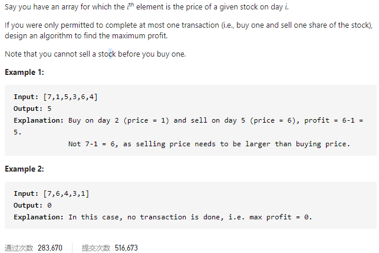

#### [121. Best Time to Buy and Sell Stock](https://leetcode-cn.com/problems/best-time-to-buy-and-sell-stock/)



---

这道题是一道基础的动态规划题.

要找到最大利润, 可以分为以下几步:

- 记录今日之前的买入最小值
- 求出今日卖出的最大利润
- 比较最大利润, 取最大值
- 比较最小值并更新

首先我们假设第一天的时候买入, 并且利润为0, 所以当前买入最小值为7, 利润为0, 然后第二天我们进行卖出, `1 - 7 = -6 < 0`, 利润不更新, 然后最小值`1 < 7`, 更新为1. 接下来第三天进行卖出, 利润为`5 - 1 = 4 > 0`, 利润更新为4, 最小值不更新. 以此类推, 最终得到了最大利润.

java代码如下:

```java
class Solution {
    public int maxProfit(int[] prices) {
        int profit = 0;
        if (prices.length == 0) {
            return profit;
        }

        int min = prices[0];
        for (int i = 1; i < prices.length; i++) {
            profit = Math.max(profit, prices[i] - min);
            min = Math.min(min, prices[i]);
        }

        return profit;
    }
}
```


