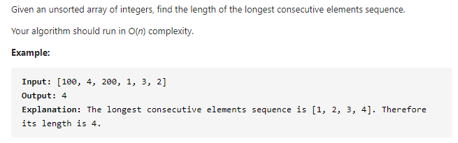

#### [128. Longest Consecutive Sequence](https://leetcode-cn.com/problems/longest-consecutive-sequence/)



---

>感觉自己好菜:weary:... 看题解都看的懂, 为啥就是自己想不出来呢:sob:...​

这道题之所以是hard题是因为时间复杂度要求为O(n), 这样的话就不能使用排序了, 因为排序的算法复杂度都是高过O(n)的.
一般来说, 对时间复杂度有要求, 就要用空间来换时间, 对空间复杂度有要求, 就要用时间换空间.

用空间来换时间的话, 想到的是HashMap或者Set. 这道题我们可以使用set来存储所有的数字, 并且可以达到去重的效果.

我们要找到最长的连续序列, 也就是1, 2, 3, 4这种的. 假设我们当前的数字是1, 我们需要判断2是否在set中, 这个操作复杂度为o(1), 然后我们继续判断3是否在set中, 直到不连续, 记录当前的长度, 再与最大的长度比较, 取大的那个就是最终的结果.

但是存在一个问题, 如果我们当前的数字是2, 前面我们已经在数字为1的时候进行过了判断, 所以这部分的判断就重复了, 我们可以去掉它. 假设当前的数字是x, 我们只需要去判断x+1是否存在于set中就可以了, 对于x-1我们可以跳过, 因为我们一定会从x-1这个位置开始判断, 所以当x-1存在于set中的时候, 我们可以直接跳过当前数字x.


java代码如下:

```java
class Solution {
    public int longestConsecutive(int[] nums) {
        Set<Integer> nums_set = new HashSet<>();

        // 将所有数字存入到set中
        for (int num : nums) {
            nums_set.add(num);
        }

        int curLen = 0, maxLen = 0;

        for (int num : nums_set) {
            int curNum = num;
            // x-1不在set中, 进入判断, 如果存在, 直接跳过
            if (!nums_set.contains(curNum - 1)) {
                curLen = 1;
				
                // 判断x+1是否存在于set中, 如果存在继续判断x+1+1, 并且更新长度
                while (nums_set.contains(curNum + 1)) {
                    curNum++;
                    curLen++;
                }
				
                // 更新当前的最大长度
                maxLen = Math.max(maxLen, curLen);
            }
        }

        return maxLen;
    }
}
```


