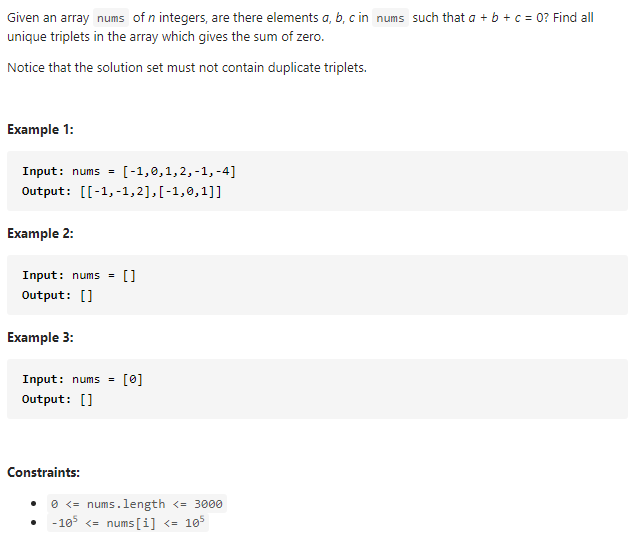

#### [15. 3Sum](https://leetcode-cn.com/problems/3sum/)



---

这是一道很经典的题. 解题思路也比较简单, 首先将数组排序, 然后使用双指针来判断当前的sum是否满足条件, 如果满足, 将左右指针移到下一个元素, 如果当前的sum大于0, 说明右边的数大了, 所以将右指针向左移动一位, 反之将左指针向右移动一位.

这里需要注意的是, 不能有重复的元素, 所以在移到下一个数之前要判断下一个数是否和当前的数一样, 如果一样跳过该元素.


```java
class Solution {
    public List<List<Integer>> threeSum(int[] nums) {
        List<List<Integer>> res = new ArrayList<>();

        if (nums.length < 3) {
            return res;
        }

        int n = nums.length;
        Arrays.sort(nums);
        
		// 选取当前的元素
        for (int i = 0; i < n; i++) {
            // 如果当前元素大于0, 由于数组是排好序的, 说明后面的元素都大于0, 所以不可能找到和为0的三元组,直接返回
            if (nums[i] > 0) {
                return res;
            }
            
            // 如果当前元素和上一个元素一样, 跳过
            if (i > 0 && nums[i] == nums[i - 1]) {
                continue;
            }

            // 左指针为当前元素的下一个元素, 右指针为数组末尾
            int l = i + 1;
            int r = n - 1;

            while (l < r) {
                int sum = nums[i] + nums[l] + nums[r];

                if (sum == 0) {
                    List<Integer> temp = new ArrayList<>();
                    temp.add(nums[i]);
                    temp.add(nums[l]);
                    temp.add(nums[r]);
                    res.add(temp);
                    while (l < r && nums[l] == nums[l + 1]) {
                        l++;
                    }

                    while (l < r && nums[r] == nums[r - 1]) {
                        r--;
                    }
                    l++;
                    r--;
                } else if (sum > 0) {
                    r--;
                } else {
                    l++;
                }
            }
        }

        return res;
    }
}
```

