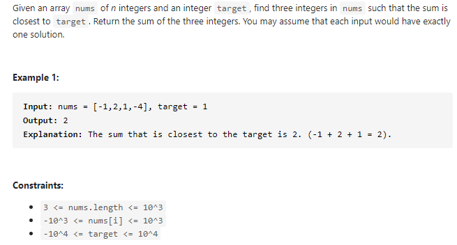

#### [16. 3Sum Closest](https://leetcode-cn.com/problems/3sum-closest/)



---

这道题与==15. 3Sum - Medium==很像, 都是使用双指针来解. 要先判断什么时候左指针加, 什么时候右指针减. 刚开始的时候没有找清楚条件, 写的很乱, 然后看了下答案, 理清了一下思路. 特别要注意的是, 这道题要求的是距离, 所以一定要用绝对值.

我们用`sum`来记录当前的和, 使用`res`来记录要返回的结果. 使用双指针的话, 数组一定要先排序.

首先要先判断当前的`sum-target`绝对值是否比之前的`res-target`绝对值小, 如果小的话, 很显然, 我们找到了一个更短的距离, 更新`res = sum`.

然后进行指针的移动, 如果当前的`sum < target`, 我们要增大`sum`的值, 也就是左指针向右移动, 因为我们要找到最小的距离, 所以`sum`越接近target, 距离就越小. 反之, 如果当前的`sum > target`, 我们要减小`sum`的值, 也就是右指针向左移动.

当`sum == target`时, 距离为0, 这个肯定是最小距离, 我们直接返回`sum`作为答案.

java代码如下:

```java
class Solution {
    public int threeSumClosest(int[] nums, int target) {
        int n = nums.length;
        int res = nums[0] + nums[1] + nums[2];

        Arrays.sort(nums);

        for (int i = 0; i < n; i++) {
            int l = i + 1;
            int r = n - 1;

            while(l < r) {
                int sum = nums[i] + nums[l] + nums[r];

                if (Math.abs(sum - target) < Math.abs(res - target)) {
                    res = sum;
                }

                if (sum > target) {
                    r--;
                } else if (sum < target) {
                    l++;
                } else {
                    return sum;
                }
            }
        }

        return res;
    }
}
```

