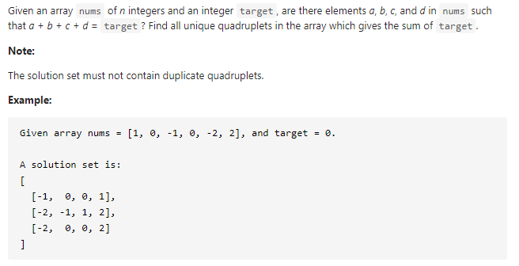

#### [18. 4Sum](https://leetcode-cn.com/problems/4sum/)



---

经典的3sum的扩展, 如果会3sum那道题的话, 这道题的思路就很简单.

固定一个数, 然后剩下的就是3sum, 也就是在3sum的基础上加一层循环. 然后利用双指针计算3sum, 注意要跳过重复元素.

我这里犯了一个很蠢的错误...被自己蠢哭了, 找了半天...**左边界一定要加, 右边界一定要减啊**, 不要再手误写错了:sob:


java代码如下:

```java
class Solution {
    public List<List<Integer>> fourSum(int[] nums, int target) {
        List<List<Integer>> res = new ArrayList<>();
        int n = nums.length;

        if (n < 4) {
            return res;
        }

        Arrays.sort(nums);

        for (int i = 0; i < n - 2; i++) {

            if (i > 0 && nums[i] == nums[i - 1]) {
                continue;
            }

            for (int j = i + 1; j < n - 2; j++) {

                if (j > i + 1 && nums[j] == nums[j - 1]) {
                    continue;
                }

                int l = j + 1;
                int r = n - 1;

                while (l < r) {
                    int temp = nums[i] + nums[j] + nums[l] + nums[r];
                    
                    if (temp == target) {
                        List<Integer> res_temp = new ArrayList<>();
                        res_temp.add(nums[i]);
                        res_temp.add(nums[j]);
                        res_temp.add(nums[l]);
                        res_temp.add(nums[r]);

                        res.add(res_temp);
                        
                        while (l < r && nums[l] == nums[l + 1]) {
                            l++;
                        }
                        while (l < r && nums[r] == nums[r - 1]) {
                            r--;
                        }
                        l++;
                        r--;
                    } else if (temp < target) {
                        l++;
                    } else {
                        r--; // 就是这里... 写成了r++, 找了半天
                    }
                }
            }

            
        }

        return res;
    }
}
```

