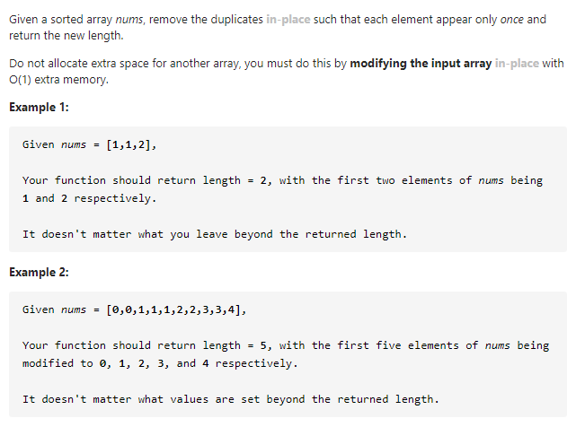

#### [26. Remove Duplicates from Sorted Array](https://leetcode-cn.com/problems/remove-duplicates-from-sorted-array/)



---

这道题思路比较简单, 因为要求不用额外的空间并且还要修改原来的数组前n位, 这里n为不重复元素的个数, 所以可以用一个快慢指针来解决.

慢指针起初指向第一个元素, 快指针指向第二个, 当`nums[slow] == nums[fast]`的时候, 将`fast`后移一位, 如果`nums[slow] != nums[fast]`, 说明找到了一个不相同的元素,  我们需要将这个不相同的元素赋值到慢指针的下一位, 因为**慢指针的下一位的值**一定与**慢指针当前指向的值**相等或者与**快指针当前指向的值**相等.

题中需要返回不相同元素的个数, 所以我们还需要一个变量去记录不相同的元素的个数, 也就是慢指针移动的长度.

java代码如下:

```java
class Solution {
    public int removeDuplicates(int[] nums) {
        int slow = 0;
        int fast = 1;
        int n = nums.length;

        if (n == 0) {
            return 0;
        }
        // 用来记录不相同的元素的个数
        int res = 0;

        // 如果快指针遍历到了数组末尾, 说明整个数组已经查找完毕, 退出循环
        while(fast < n) {
            if (nums[slow] == nums[fast]) {
                fast++;
            } else {
                nums[++slow] = nums[fast];
                res++;
            }
        }

        // 因为第一个元素没有记录进去, 所以要加1
        return res + 1;
    }
}
```

