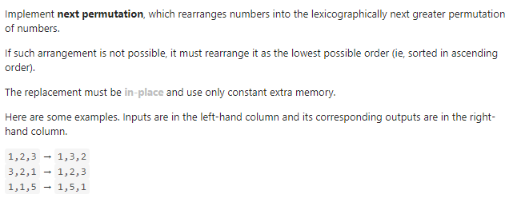

#### [31. Next Permutation](https://leetcode-cn.com/problems/next-permutation/)



---

这道题的描述很抽象... 搞了半天才弄懂啥意思.

举个例子, 比如说`1, 2, 3`这三个数字就有如下几种排列

```java
1, 2, 3
1, 3, 2
2, 1, 3
2, 3, 1
3, 1, 2
3, 2, 1
```

其实可以把它们看成数字`123 < 132`. 这道题需要我们找出下一个排列, 也就是下一个比当前数字大的数字, 比如说`1, 2, 3`的话, 就是找到`1, 3, 2`. 这里面有什么规律呢?

当我们找下一个排列的时候, 我们需要做什么? 我们发现最大的数一定是降序排列的, 比如`3, 2, 1`, 最小的数一定是升序排列的, 比如`1, 2, 3`.

这里我们再举一个例子, 用一个稍微长一点的排列, 比如说`1, 2, 6, 5, 4, 3`, 它的下一个排列是`1, 3, 2, 4, 5, 6`. 我们可以发现一个规律, 当我们寻找下一个排列的时候, 我们先从后往前去寻找**第一对相邻的增序数字**, 比如说`1, (2, 6), 5, 4, 3`, `(2, 6)`就是第一对的增序数字, 然后我们再去从后往前去找**第一个**比`2`大的数字, 这里第一个比`2`大的数字是`3`. 

然后我们交换`2`和`3`, 从而形成一个新的排列`1, 3, 6, 5, 4, 2`. 这个排列显然不是下一个排列, 因为这个时候我们的新的位置的`3`比以前的位置的`2`要大, 但它之后的排列不是**最小排列**. 因为`6, 5, 4, 2`是一个降序排列, 它一定是最大的排列, 我们要将它变为最小的排列, 所以需要将其反转, 变为`2, 4, 5, 6`. 这样最后的排列`1, 3, 2, 4, 5, 6`就一定是下一个排列.

分析到这里, 我们的算法很容易得出了:

- 首先先从后往前找到第一对相邻的增序数字`(i, j)`满足`A[i] < A[j]`.
- 再从后往前找到第一个大于`i`的数字`k`满足`A[k] > A[i]`.
- 交换`i`和`k`, 也就是`swap(A[i], A[k])`.
- 然后反转`i + 1`之后的排列, 也就是`reverse(A, i + 1)`, `i + 1`为开始反转的位置.
- 此时得到的排列即为下一个排列.

java代码如下:

```java
class Solution {
    public void nextPermutation(int[] nums) {
        int n = nums.length - 2;

        // 找到第一个相邻的增序对
        while (n >= 0 && nums[n + 1] <= nums[n]) {
            n--;
        }

        if (n >= 0) {
            int end = nums.length - 1;
            // 找到第一个大于nums[n]的数字
            while (end >= 0 && nums[end] <= nums[n]) {
                end--;
            }
            // 交换nums[n]和nums[end]
            swap(nums, end, n);
        }
        // 反转n + 1 之后的排列
        reverse(nums, n + 1);

    }

    private void swap (int[] nums, int i, int j) {
        int temp = nums[i];
        nums[i] = nums[j];
        nums[j] = temp;
    }

    private void reverse(int[] nums, int start) {
        int i = start, j = nums.length - 1;
        while (i < j) {
            swap(nums, i, j);
            i++;
            j--;
        }
    }
}
```

