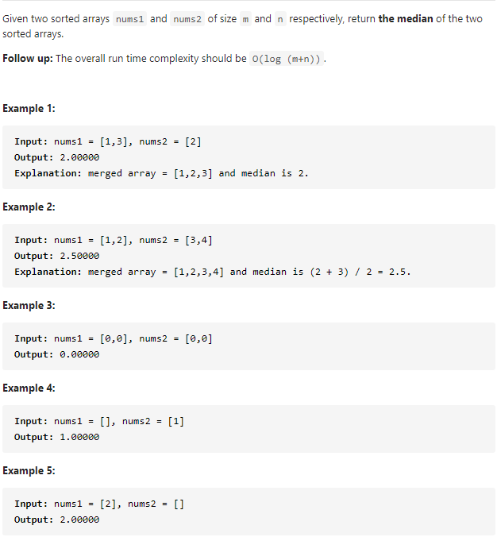
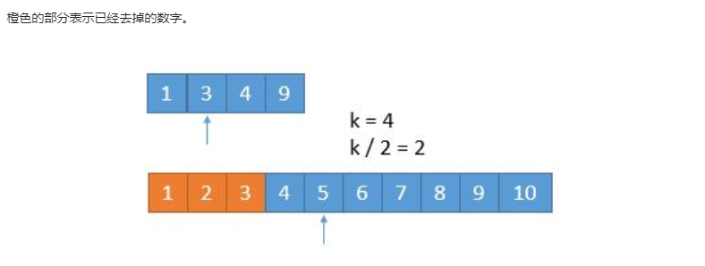

#### [4. Median of Two Sorted Arrays](https://leetcode-cn.com/problems/median-of-two-sorted-arrays/)



---

1. 暴力解法

   首先将两个数组合并,然后根据长度是奇数还是偶数返回中位数.

   ```java
   class Solution {
       public double findMedianSortedArrays(int[] nums1, int[] nums2) {
           int n = nums1.length; 
           int m = nums2.length;
   
           if (n == 0) {
               if (m % 2 == 0) {
                   return (nums2[m / 2] + nums2[m / 2 - 1]) / 2.0;
               } else {
                   return nums2[m / 2];
               }
           }
   
           if (m == 0) {
               if (n % 2 == 0) {
                   return (nums1[n / 2] + nums1[n / 2 - 1]) / 2.0;
               } else {
                   return nums1[n / 2];
               }
           }
   
   
           int[] merge = new int[m + n];
           int count = 0, i = 0, j = 0;
   
           while (count != (m + n)) {
               if (i == n) {
                   while (j != m) {
                       merge[count++] = nums2[j++];
                   }
                   break;
               }
   
               if (j == m) {
                   while (i != n) {
                       merge[count++] = nums1[i++];
                   }
                   break;
               }
   
               if (nums1[i] <= nums2[j]) {
                   merge[count++] = nums1[i++];
               } else {
                   merge[count++] = nums2[j++];
               }
           }
   
           if (count % 2 == 0) {
               return (merge[count / 2] + merge[count / 2 - 1]) / 2.0;
           } else {
               return merge[count / 2];
           }
   
   
       }
   }
   ```
   
---

2. 二分法

   一般的题目要求O(log(n)),大部分都是可以使用二分法来解决的.

   
   
   对于这道题来说, 首先考虑如何找到中位数. 如果一个数组(长度为n)为奇数, 那么它的中位数为中间的那个数, 也就是n/2位置的那个数. 如果一个数组为偶数, 那么它的中位数为中间的两个数除以2, 也就是((n/2 - 1) + (n/2)) / 2 的那个位置.
   
   
   
   假设有数组A和数组B, 我们可以比较A[k/2-1]和B[k/2-1], 如果A[k/2-1] < B[k/2-1], 说明A[k/2-1]之前的元素都不符合要求, 也就是它们中间不可能存在中位数k.
   
   所以存在三种情况:
   
   - 如果A[k/2-1] < B[k/2-1], 那么可以排除A[k/2-1]之前的所有元素.
   - 如果A[k/2-1] > B[k/2-1], 那么可以排除B[k/2-1]之前的所有元素.
   - 如果A[k/2-1] = B[k/2-1], 可以看做与情况1相同.
   
   
   
   代码如下
   
   ```java
   class Solution {
       public double findMedianSortedArrays(int[] nums1, int[] nums2) {
           int n = nums1.length; 
           int m = nums2.length;
           int mid1 = (n + m + 1) / 2;
           int mid2 = (n + m + 2) / 2;
           // 这里+1和+2相当于将奇数和偶数的情况都考虑进去了. 假设总长度为8, 那么mid1=9/2=4, mid2=10/2=5,
           // 假设总长度为7, mid1=8/2=4, mid2=9/2=4.
           return (findK(nums1, 0, nums2, 0, mid1) + findK(nums1, 0, nums2, 0, mid2)) / 2.0;
       }
   
       private int findK (int[] nums1, int i, int[] nums2, int j, int k) {
           // 当i超出nums1的边界, 只需要找到剩余的nums2中的中位数就可以了
           if (i >= nums1.length) {
               return nums2[j + k - 1];
           }
           if (j >= nums2.length) {
               return nums1[i + k - 1];
           }
           // 如果k=1,说明中位数已经找到,直接返回两个数组的最小值就可以了
           if (k == 1) {
               return Math.min(nums1[i], nums2[j]);
           }
   		
           // 计算出每次要比较的两个数的值，来决定 "删除" 哪边的元素
           int mid1 = (i + k / 2 - 1) < nums1.length ? nums1[i + k / 2 - 1] : Integer.MAX_VALUE;
           int mid2 = (j + k / 2 - 1) < nums2.length ? nums2[j + k / 2 - 1] : Integer.MAX_VALUE;
           // 通过递归的方式，来模拟删除掉前K/2个元素, 然后找第k-k/2小的数
           if (mid1 < mid2) {
               return findK(nums1, i + k / 2, nums2, j, k - k / 2);
           } else {
               return findK(nums1, i, nums2, j + k / 2, k - k / 2);
           }
       }
   }
   ```
   
   
   
   