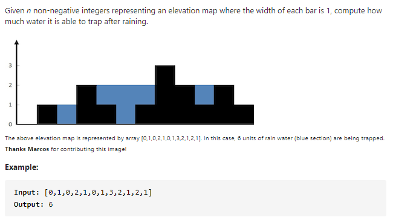

#### [42. Trapping Rain Water](https://leetcode-cn.com/problems/trapping-rain-water/)



---

题解思路来源: https://leetcode-cn.com/problems/trapping-rain-water/solution/xiang-xi-tong-su-de-si-lu-fen-xi-duo-jie-fa-by-w-8/

1. 按列求

   对于每一列的能放多少水, 我们只需要关心当前列的左边最高的列(maxLeft), 右边最高的列(maxRight)即可. 这样会产生三种情况.

   - 当前列比min(maxLeft, maxRight)矮, 如图所示.

     

     图中当前列上能放多少水? 很明显, 我们可以用左边最高列的和右边最高列中较小的那一个减去当前列来得到可以放水的数量 (min(maxLeft, maxRight) - height[i]).
     
   - 当前列比min(maxLeft, maxRight)高, 如图所示.

     

     此时, 当前列上不能放水, 因为它比左右两边之一高.

   - 当前列和min(maxLeft, maxRight)一样, 如图所示.

     

     这种情况与上一种情况相同, 也不能放水.
     
     时间复杂度为O(n²).
     
     
     
     java代码如下
     
     ```java
     class Solution {
         public int trap(int[] height) {
             int res = 0;
             int n = height.length;
             
             for (int i = 1; i < n - 1; i++) {
                 int maxLeft = 0, maxRight = 0;
                 for (int j = i - 1; j >= 0; j--) {
                     maxLeft = Math.max(maxLeft, height[j]);
                 }
                 for (int k = i + 1; k < n; k++) {
                     maxRight = Math.max(maxRight, height[k]);
                 }
     
                 int min = Math.min(maxLeft, maxRight);
                 if (min > height[i]) {
                     res += min - height[i];
                 }
             }
     
             return res;
         }
     }
     ```
     
     
   
2. 动态规划

   上面的那种解法我们每次都要去计算maxLeft和maxRight, 这个很耗时. 所以我们可以使用一个maxRight[i]和maxLeft[i]数组去存储当前列的左右最高列. 这样就不用在每次遍历中去求maxLeft和maxRight了. 时间复杂度变为O(n).

   ```java
   class Solution {
       public int trap(int[] height) {
           int res = 0;
           int n = height.length;
           int[] maxLeft = new int[n];
           int[] maxRight = new int[n];
   
           for (int i = 1; i < n - 1; i++) {
               maxLeft[i] = Math.max(maxLeft[i - 1], height[i - 1]);
           }
   
           for (int i = n - 2; i > 0; i--) {
               maxRight[i] = Math.max(maxRight[i + 1], height[i + 1]);
           }
           
           for (int i = 1; i < n - 1; i++) {
               int min = Math.min(maxLeft[i], maxRight[i]);
               if (min > height[i]) {
                   res += min - height[i];
               }
           }
   
           return res;
       }
   }
   ```

   

​     