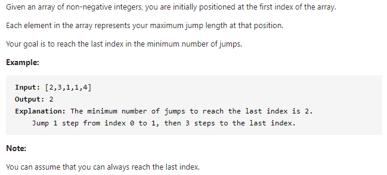

#### [45. Jump Game II](https://leetcode-cn.com/problems/jump-game-ii/)



---

这道题虽然是hard题, 但是竟然意外的简单和好理解...

思路为贪心, 先找局部最优然后扩展到全局最优.

首先我们是想要找到到达尾部的最小步数, 为了找到这个最小步数, 我们可以在每一步都找该步数内的最大值作为下一步. 比如我们起始在2的位置, 在2的范围内有3和1两个数, 很明显, 如果我们走到3的话下一步的步数是最大的. 这里借用LeetCode题解里的一幅图来解释一下会更清楚.(图来源于https://leetcode-cn.com/problems/jump-game-ii/solution/xiang-xi-tong-su-de-si-lu-fen-xi-duo-jie-fa-by-10/)


所以代码的话就比较简单了, 我们定义一个边界来看当前走到了哪里, 如果到达了边界就将总步数+1, 并且更新边界.

java代码如下:

```java
class Solution {
    public int jump(int[] nums) {
        int n = nums.length;
        
        if (n == 0) {
            return 0;
        }

        int end = 0;
        int maxPos = nums[0];
        int step = 0;
		
        // 这里需要注意一下, i是小于n-1的, 也就是说最后一个元素我们不走.
        // 因为我们刚开始的时候在0的位置已经将step+1了,
        // 如果我们刚好走到了最后一个元素, 此时i=end, 会进入if中将step再加1
        // 这样的话step就会多加了一次
        for (int i = 0; i < n - 1; i++) {
            maxPos = Math.max(maxPos, i + nums[i]);

            // 判断是否抵达了边界, 更新边界, step+1
            if (i == end) {
                end = maxPos;
                step++;
            }
        }

        return step;
    }
}
```

