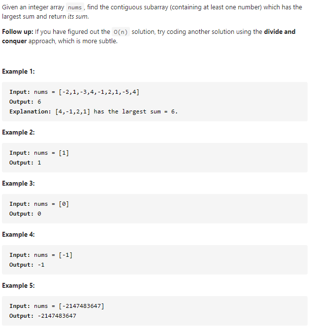

#### [53. Maximum Subarray](https://leetcode-cn.com/problems/maximum-subarray/)



---

本题可以采用动态规划的思想.

从头遍历数组, 计算子数组和sum, 如果sum>0, 说明当前的sum对于最终结果有增益的效果, 所以将sum保留并且加上当前的数字num. 如果sum<0, 说明当前的sum对于最终结果没有增益的效果, 所以将sum舍弃, 将当前的数字作为新的sum. 每轮遍历取sum和res中的最大值.


```java
class Solution {
    public int maxSubArray(int[] nums) {
        int res = nums[0];
        int sum = 0;

        for (int num : nums) {
            if (sum > 0) {
                sum += num;
            } else {
                sum = num;
            }
            res = Math.max(res, sum);
        }
        return res;
    }
}
```

