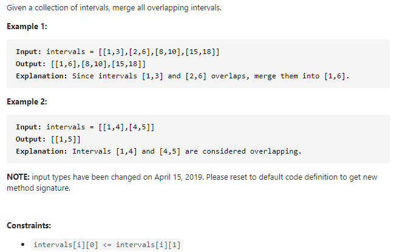

#### [56. Merge Intervals](https://leetcode-cn.com/problems/merge-intervals/)



---

因为本题没有说给定的输入数组是否是排序过的, 所以我们要先根据intervals中的每个数组的第一个元素进行从小到大的排序. 我们定义**intervals**中的每个一位数组为**interval**(注意没有"s").

当`interval[0] > 前一个interval[1]`说明当前区间可以直接加入到res数组中, 不需要合并. 如果`interval[0] < 前一个interval[1]`, 说明当前两个区间可以合并, 我们只需要判断后边界是谁就可以了, 也就判断`max(interval[1], 前一个interval[1])`. 最后我们可以得到一个合并好的数组.

java代码如下:

```java
class Solution {
    public int[][] merge(int[][] intervals) {
        int[][] res = new int[intervals.length][2];

        Arrays.sort(intervals, (v1, v2) -> v1[0] - v2[0]);

        // 如果当前是第一对, 我们直接将它加入到res中
        int idx = -1;
        for (int[] interval : intervals) {
            if (idx == -1 || interval[0] > res[idx][1]) {
                res[++idx] = interval;
            } else {
                res[idx][1] = Math.max(res[idx][1], interval[1]);
            }
        }
		
        // 此时idx为最后一个区间的位置, res中剩余的位置可能为[0, 0], 也就是没有区间对
        // 因为res可能是比intervals短的, 所以将idx+1的长度数组返回作为答案
        return Arrays.copyOf(res, idx + 1);
    }
}
```

