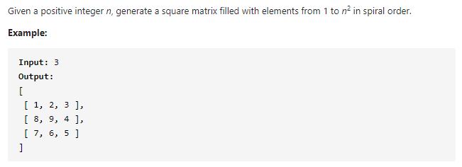

#### [59. Spiral Matrix II](https://leetcode-cn.com/problems/spiral-matrix-ii/)



---

螺旋生成二维数组. 直接进行模拟大法.

首先从左到右, 然后从上到下, 从右到左, 最后从下到上填数字, 数字从1到n².

每填完一个方向, 将该方向收缩1. 比如第一次填第一行, 从左到右, 填完之后将上边界下移1, 因为第一行已经被填完了, 所以我们可以安全的下移. 类似的, 右边界填完要往左收缩1, 下边界填完要往上收缩1, 左边界填完要往右收缩1.

这张图我觉得完美解释了这个模拟的过程, 图来源于LeetCode题解(https://leetcode-cn.com/problems/spiral-matrix-ii/solution/spiral-matrix-ii-mo-ni-fa-she-ding-bian-jie-qing-x/).


java代码如下:

```java
class Solution {
    public int[][] generateMatrix(int n) {
        int[][] res = new int[n][n];

        int l = 0, r = n - 1, t = 0, b = n - 1;
        int num = 1;

        while (num <= n * n) {
            for (int i = l; i <= r; i++) {
                res[t][i] = num;
                num++;
            }
            t++;
            
            for (int i = t; i <= b; i++) {
                res[i][r] = num;
                num++;
            }
            r--;

            for (int i = r; i >= l; i--) {
                res[b][i] = num;
                num++;
            }
            b--;

            for (int i = b; i >= t; i--) {
                res[i][l] = num;
                num++;
            }
            l++;
        }

        return res;
    }
}
```

