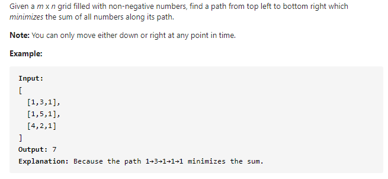
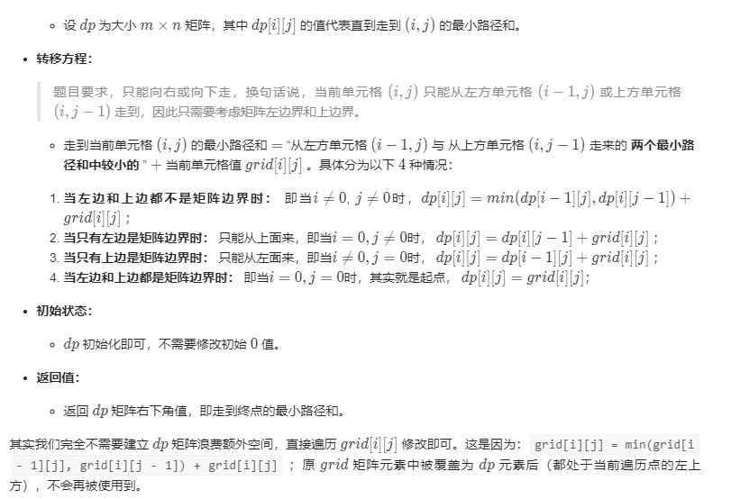

#### [64. Minimum Path Sum](https://leetcode-cn.com/problems/minimum-path-sum/)



---

求最短路径, 简单又经典的动态规划题.

第一时间想到的是用一个dp数组去存之前的最短路径和, 刚开始没想到如何处理边界, 看了一下评论区大佬们的思路, 有了比较清晰的思路.

首先将左边界和上边界先存入dp数组, 也就是计算`dp[i][0] = grid[i][0] + dp[i - 1][0]`和`dp[0][i] = grid[0][i] + dp[0][i - 1]`, 然后再计算其他位置, 这个就比较简单了, 比较之前的左和上的路径和然后加上当前的值, `dp[i][j] = grid[i][j] + min(dp[i - 1][j], dp[i][j - 1])`. 最后dp数组的最后一个元素即为最小值.

java代码如下:

```java
class Solution {
    public int minPathSum(int[][] grid) {
        int res = 0;
        int row = grid.length, col = grid[0].length;
        int[][] dp = new int[row][col];
        dp[0][0] = grid[0][0];

        for (int i = 1; i < row; i++) {
            dp[i][0] = dp[i - 1][0] + grid[i][0];
        }
        for (int j = 1; j < col; j++) {
            dp[0][j] = dp[0][j - 1] + grid[0][j];
        }

        for (int i = 1; i < row; i++) {
            for (int j = 1; j < col; j++) {
                dp[i][j] = grid[i][j] + Math.min(dp[i - 1][j], dp[i][j - 1]);
            }
        }

        return dp[row - 1][col - 1];

    }
}
```

---

>来源于:https://leetcode-cn.com/problems/minimum-path-sum/solution/zui-xiao-lu-jing-he-dong-tai-gui-hua-gui-fan-liu-c/

做完之后看了下题解, 发现可以有更好的方法, 将空间复杂度优化到O(1). 

我们可以不新建一个dp数组, 直接在原有的grid数组上进行修改.



代码如下:

```java
class Solution {
    public int minPathSum(int[][] grid) {
        for(int i = 0; i < grid.length; i++) {
            for(int j = 0; j < grid[0].length; j++) {
                if(i == 0 && j == 0) continue;
                else if(i == 0)  grid[i][j] = grid[i][j - 1] + grid[i][j];
                else if(j == 0)  grid[i][j] = grid[i - 1][j] + grid[i][j];
                else grid[i][j] = Math.min(grid[i - 1][j], grid[i][j - 1]) + grid[i][j];
            }
        }
        return grid[grid.length - 1][grid[0].length - 1];
    }
}

```


