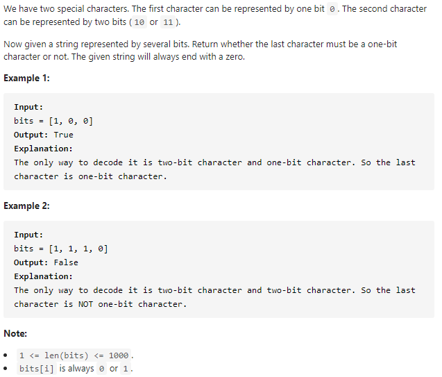

#### [717. 1-bit and 2-bit Characters](https://leetcode-cn.com/problems/1-bit-and-2-bit-characters/)



---

这道题要判断最后一位能否构成一个1-bit的字符, 也就是说判断最后一位是否为0并且不能和前面的1组成一个2-bits的字符.

我们可以从前往后进行遍历, 当遇到1的时候, 说明它必然和下一位组成一个2-bits的字符, 所以我们可以跳过下一个数字, 直接将index + 2. 当遇到0的时候, 我们可以直接将index + 1, 因为0只能组成1-bit的字符. 当我们遍历完倒数第二个元素的时候, 我们可以来检查index是否与数组长度-1相等, 如果相等的话就说明最后一个元素必然为0且不能和倒数第二个元素组成一个2-bits的字符, 如果不相等的话说明最后一个元素与倒数第二个元素组成了一个2-bits的字符.


java代码如下:

```java
class Solution {
    public boolean isOneBitCharacter(int[] bits) {
        int start = 0;

        while (start < bits.length - 1) {
            if (bits[start] == 0) {
                start++;
            } else {
                start += 2;
            }
        }
		// 此时的start为倒数第二个元素+1或者+2, 
        // 如果+1的话说明倒数第二个元素是0, start刚好等于bits.length - 1.
        // 如果+2的话说明倒数第二个元素为1, 并且start会大于bits.length - 1.
        return start == bits.length - 1;
    }
}
```


