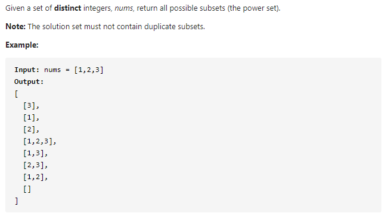
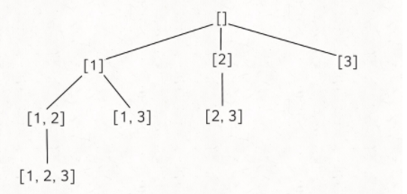

#### [78. Subsets](https://leetcode-cn.com/problems/subsets/)



---

感觉智商被碾压了... 大佬们能有5,6种方法解这道题... 回溯法也没看懂:sob:~~(位运算基本放弃)~~

只能看懂一种循环遍历了..

思路如下:

从res数组列表中取出数组, 然后将当前数组元素加入到该数组中, 组成一个新的数组, 再加入到res数组列表中.

比如起始res中为`[[]]`, 然后选取`nums[0] = 1`作为第一个元素, 然后用一个`temp`来存`nums[0]`, 再将`temp`加入到`res`中. 现在`res`中为`[[], [1]]`. 现在我们选取`nums[1] = 2`作为下一个元素, 现在res的大小为2, 我们应当加入的数组为`[2]`和`[1, 2]`. 所以我们先取出`res`中的数组作为temp, 然后加入当前的元素`nums[1]`, 第一次取出的数组为`[]`, 加入`nums[1]`之后为`[2]`, 然后加入到`res`中. 第二次取出的数组为`[1]`, 加入`nums[1]`之后为`[1, 2]`, 再加入到`res`中.


java代码如下:

```java
class Solution {
    public List<List<Integer>> subsets(int[] nums) {
        List<List<Integer>> res = new ArrayList<>();
        res.add(new ArrayList<Integer>());

        for (int i = 0; i < nums.length; i++) {
            int size = res.size();
            for (int j = 0; j < size; j++) {
                List<Integer> temp = new ArrayList<>(res.get(j));
                temp.add(nums[i]);
                res.add(temp);
            }
        }
        return res;
    }
}
```


>等我再研究研究回溯法...应该要总结一些算法模板了...:weary:自己好菜



研究了一下回溯法... 从大佬那里拿了一套模板过来...(来源于:https://leetcode-cn.com/problems/subsets/solution/hui-su-si-xiang-tuan-mie-pai-lie-zu-he-zi-ji-wen-t/)

```python
result = []
def backtrack(路径, 选择列表):
    if 满足结束条件:
        result.add(路径)
        return
    for 选择 in 选择列表:
        做选择
        backtrack(路径, 选择列表)
        撤销选择
```

对于这道题来说, 我们的结束条件为`index > nums.length`, 做选择就为加入新的元素到`temp`数组, 路径为`nums`中的下一个元素, 撤销选择为移除`temp`数组中的最后一个元素.

代码如下, 需要细品...

```java
class Solution {
    public List<List<Integer>> subsets(int[] nums) {
        List<List<Integer>> res = new ArrayList<>();
        backtrack(nums, 0, res, new ArrayList<>());
        return res;
    }

    private void backtrack(int[] nums, int i, List<List<Integer>> res, List<Integer> temp) {
        res.add(new ArrayList<>(temp));
		// 结束条件在循环里判断了
        for (int j = i; j < nums.length; j++) {
            temp.add(nums[j]);
            backtrack(nums, j + 1, res, temp);
            temp.remove(temp.size() - 1);
        }

    }
}
```


