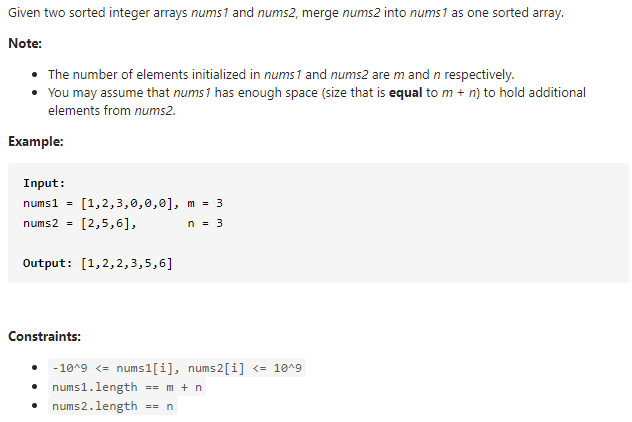

#### [88. Merge Sorted Array](https://leetcode-cn.com/problems/merge-sorted-array/)



---

刚开始想到了最简单也是最直接的解法是将`nums2`数组合并到`nums1`数组然后再排序, 但是这种方法时间复杂度不是很好, 就没有测试.

再然后想到了双指针, 首先将`nums1`保存到一个新数组`nums1_copy`, 因为这道题要求最后更改`nums1`中的元素. 然后从前到后进行`nums1_copy`和`nums2`的比较, 谁小将谁放到`nums1`中, 然后移动指针. 但是这种方法需要额外的空间. 我们可以不使用额外的空间去解.

如果我们从后往前使用双指针, 谁大就把谁放到`nums1`的末尾, 这样就可以避免使用额外空间.

java代码如下:

```java
class Solution {
    public void merge(int[] nums1, int m, int[] nums2, int n) {
        int p1 = m - 1, p2 = n - 1;
        int p = m + n - 1;

        while(p1 >= 0 && p2 >= 0) {
            // 比较nums1和nums2的数谁大, 大的数进入到nums1的末尾
            if (nums1[p1] < nums2[p2]) {
                nums1[p--] = nums2[p2--];
            } else {
                nums1[p--] = nums1[p1--];
            }
        }
		
        // 如果nums2的数组还没有遍历完, 而此时nums1已经遍历完, 
        // 直接将nums2中剩余的元素赋值到nums1中开头的位置(长度为nums2剩余元素的长度).
        // 这样做是没有风险的, 因为nums1前p2+1长度的元素已经放入到nums1[p2+1]的位置了.
        System.arraycopy(nums2, 0, nums1, 0, p2 + 1);

    }
}
```

