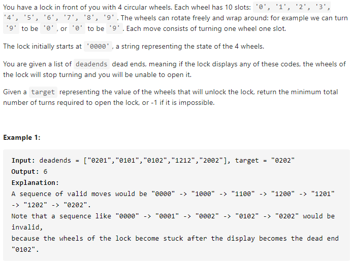

#### [752. Open the Lock](https://leetcode-cn.com/problems/open-the-lock/)



---

超长的题干...简单来说就是一个四位的密码锁, 从0可以转到9, 每次只能转一位, 需要计算出转到正确密码所需要的最小步数. 这里面还有一个deadends的概念, 就是这里面的数字不能转到, 如果转到这个锁就被锁死了, 不能继续使用了.

这道题可以想象成一颗树. 起始我们的根节点为`"0000"`, 然后我们有八个叶子节点`"0001", "0010", "0100", "1000", "9000", "0900", "0090", "0009"`. 然后以后的每个叶子节点都会有八个子节点. 这样问题就转换为了找出一个树的最小深度. 我们可以使用BFS套框架来解.

这里有两点需要注意的. 举个例子, 当我们走到`"0001"`的时候, 下一次可能有走回到了`"0000"`, 所以我们需要一个set来记录走过的节点. 第二个问题就是题目中的deadends的问题, 我们也需要一个set来记录deadends, 当遇到deadend的时候将其跳过.

java代码如下:

```java
class Solution {
    public int openLock(String[] deadends, String target) {
        Set<String> deads = new HashSet<>();
        for (String s : deadends) {
            deads.add(s);
        }
        Set<String> visited = new HashSet<>();
        Queue<String> q = new LinkedList<>();
        q.offer("0000");
        visited.add("0000");
        int step = 0;

        while (!q.isEmpty()) {
            int size = q.size();
            for (int i = 0; i < size; i++) {
                String cur = q.poll();

                if (deads.contains(cur)) {
                    continue;
                }
                if (cur.equals(target)) {
                    return step;
                }
                for (int j = 0; j < 4; j++) {
                    String up = plusOne(cur, j);
                    if (!visited.contains(up)) {
                        q.offer(up);
                        visited.add(up);
                    }
                    String down = minusOne(cur, j);
                    if (!visited.contains(down)) {
                        q.offer(down);
                        visited.add(down);
                    }
                }
            }
            step++;
        }
        return -1;
    }
	
    // 0-9的下一个数字
    private String plusOne(String cur, int j) {
        char[] s = cur.toCharArray();
        if (s[j] == '9') {
            s[j] = '0';
        } else {
            s[j] += 1;
        }
        return new String(s);
    }
	// 0-9的上一个数字
    private String minusOne(String cur, int j) {
        char[] s = cur.toCharArray();
        if (s[j] == '0') {
            s[j] = '9';
        } else {
            s[j] -= 1;
        }
        return new String(s);
    }
}
```