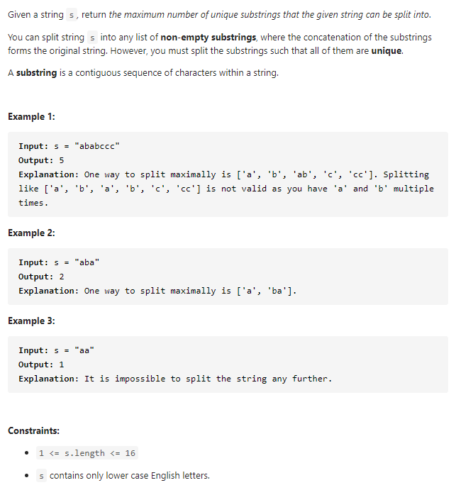

#### [5520. Split a String Into the Max Number of Unique Substrings](https://leetcode-cn.com/problems/split-a-string-into-the-max-number-of-unique-substrings/)



---

> 周赛好难啊...只能做个打卡题...
>
> 这道题刚开始想到了是回溯, 但是没写出来..用栈写了一大堆的不知道是什么的代码, 好笨:sweat_smile:
>
> 今天看了下大佬们的题解, 对于回溯有了一点感觉, 来记录一下回溯的思想.


这道题为啥会想到回溯呢? 因为我们要找最大的不重复子字符串的数量, 比如"abc", 我们得到的最大的不重复子字符串数量为3, 所以我们要尽可能的拿到短的子字符串, 最好是单个字母. 如果我们遇到了重复的怎么办? 比如"aba", 到最后一个"a"的时候重复了, 这个时候我们需要回到上一个状态, 将两个字母合起来变为一个字符串, 同时将上一个状态从集合里删除掉. 这个思想就是回溯的思想了.

代码要咋写呢...千古难题:smile:

我们先来分析下思路吧. 首先我们需要一个set来存储已经拆分的子字符串(因为不允许出现重复的子字符串). 然后我们开始拆分字符串(从begin到end), 当子字符串在set中不存在的时候, 我们可以直接将该子字符串加入到set中, 然后去判断下一个子字符串, 也就是将begin和end都移动1. 如果子字符串存在在set中, 我们就要将end移动1, 而begin不变, 这样就扩大了子字符串. 当我们达到了字符串的末尾的时候, 说明拆分完毕了, 这个时候比较一下set的大小和当前的res哪个大, 大的作为答案. 然后最重要的一点来了, 当我们拆分完一种情况的时候, 要将其回溯. 所以在我们拆分完毕返回之后, 要将当前的子字符串从set中删除. 这样就完成了整个回溯.

---

回溯法有点抽象, 我来举个例子就比较好理解了. 假设当前的字符串`s = "abac"`, `begin = 0`, `res = 0`, 我们使用`i`来作为`end`, 同时还有一个`set`来记录当前的拆分情况, 定义回溯函数为`backtrack(String s, int begin)`.

1. 首先我们从0开始, 第一个子字符串为"a", 不存在于set中, 加入到set, 此时`begin = 0, i = 0`. 然后判断下一个子字符串.

2 . 进入下一次的`backtrack(s, i + 1)`, 从`i + 1`开始, 子字符串为"b", 不存在于set中, 加入到set. 此时`begin = 1, i = 1`. 判断下一个子字符串.

3. 第三次进入`backtrack(s, i + 1)`, 这时的`i = 1`是从第二层传进来的, 所以当前的`i + 1 = 2`, 子字符串为"a", 在set中存在, 所以我们将`i`再加1, 得到子字符串为"ac", 不存在于set中, 加入到set. 同时我们达到了字符串的尾部, 此时`set = {"a", "b", "ac"}`, 长度为3, 当前的res为0, 所以更新`res = 3`, 然后该层返回, 同时删除子字符串"ac", 回到第二层.
4. 第二层此时的`begin = 1, i = 1`, `set = {"a", "b"}`, 当前的子字符串已经加入完毕, 并且之后的子字符串已经由第三层判断完毕, 所以将"b"删除, 同时`i + 1`. 此时`begin = 1, i = 2`, `set = {"a"}`, 子字符串为"ba", 不存在于set中, 加入到set, 然后进入`backtrack(s, i + 1 = 3)`, 判断"c".
5. 以此类推, 直到所有的情况都遍历完毕.


如果觉得上面的解释看不懂的话, 还是直接看代码吧...

java代码如下:

```java
class Solution {
    int res = 0;
    Set<String> set = new HashSet<>();

    public int maxUniqueSplit(String s) {
        backtrack(s, 0);
        return res;
    }

    private void backtrack(String s, int begin) {
		/* 这个剪枝可以大幅优化时间, 若当前已拆分结果加上剩余字符数小于之前得到的答案，则没有必要再进行下去
        来源于https://leetcode-cn.com/problems/split-a-string-into-the-max-number-of-unique-substrings/solution/javahui-su-4ms29mb-by-xiaoxi666/
        */
        if (set.size() + s.length() - begin <= res) {
            return;
        }

        // 达到了尾部
        if (begin == s.length()) {
            res = Math.max(res, set.size());
            return;
        }

        // 进行回溯, 这里i即为end
        for (int i = begin; i < s.length(); i++) {
            String sub = s.substring(begin, i + 1);
            if (!set.contains(sub)) {
                set.add(sub);
                backtrack(s, i + 1);
                set.remove(sub);
            }
        }
    }
}
```


