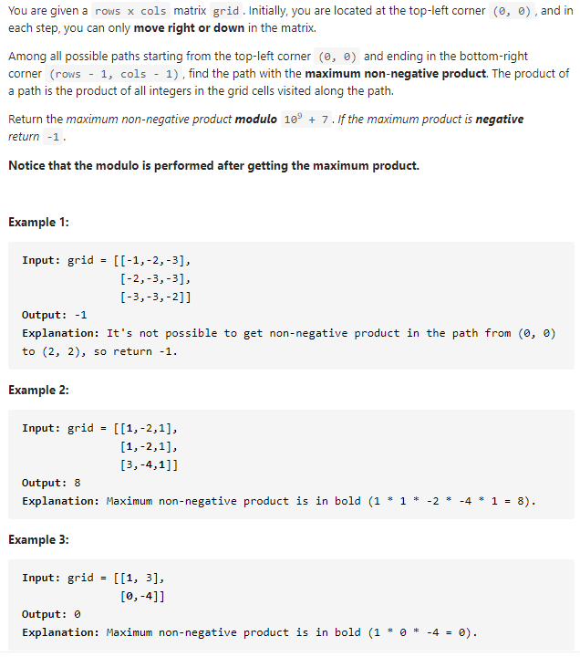
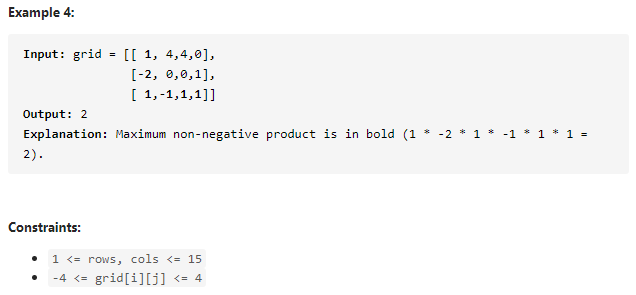

#### [5521. Maximum Non Negative Product in a Matrix](https://leetcode-cn.com/problems/maximum-non-negative-product-in-a-matrix/)





---

>虽然一眼就能看出是动态规划题, 而且前段时间刚好做过求最大矩阵和的题, 但是这道题换成了乘法就让我有点懵逼了...菜是原罪啊:weary:

矩阵求最大合会做, 求最大积呢? 特别是矩阵中有负数的情况下.

乘积是有正负的, 如果上一个数是一个很小的负数或者很大的正数, 下一步就可能变成了很大的正数或者很小的负数了...所以为了应付这种情况, 可以使用两个dp数组, 一个存储路径的最大值(pos, 会出现正数), 一个来存储路径的最小值(neg, 会出现负数).~~我咋就没想到用两个dp数组呢...~~

当前的数`grid[i][j]`如果为正数, 那么就将当前的路径最大乘积更新为`pos[i][j] = max(pos[i - 1][j], pos[i][j - 1]) * grid[i][j]`, 最小乘积为`neg[i][j] = min(neg[i - 1][j], neg[i][j - 1]) * grid[i][j]`.

如果`grid[i][j]`为负数, 最大路径乘积更新为`pos[i][j] = min(neg[i - 1][j], neg[i][j - 1]) * grid[i][j]`, 最小乘积为`neg[i][j] = max(pos[i - 1][j], pos[i][j - 1]) * grid[i][j]`

java代码如下:
```java
class Solution {
    public int maxProductPath(int[][] grid) {
        int MOD = (int) 1e9+7;
        int row = grid.length, col = grid[0].length;
        long[][] pos = new long[row][col];
        long[][] neg = new long[row][col];
        pos[0][0] = neg[0][0] = grid[0][0];

        for (int i = 0; i < row; i++) {
            for (int j = 0; j < col; j++) {
                if (i == 0 && j == 0) {
                    continue;
                } else if (i == 0) {
                    if (grid[i][j] > 0) {
                        pos[i][j] = pos[i][j - 1] * grid[i][j];
                        neg[i][j] = neg[i][j - 1] * grid[i][j];
                    } else {
                        pos[i][j] = neg[i][j - 1] * grid[i][j];
                        neg[i][j] = pos[i][j - 1] * grid[i][j];
                    }
                } else if (j == 0) {
                    if (grid[i][j] > 0) {
                        pos[i][j] = pos[i - 1][j] * grid[i][j];
                        neg[i][j] = neg[i - 1][j] * grid[i][j];
                    } else {
                        pos[i][j] = neg[i - 1][j] * grid[i][j];
                        neg[i][j] = pos[i - 1][j] * grid[i][j];
                    }
                } else {
                    if (grid[i][j] > 0) {
                        pos[i][j] = Math.max(pos[i][j - 1], pos[i - 1][j]) * grid[i][j];
                        neg[i][j] = Math.min(neg[i][j - 1], neg[i - 1][j]) * grid[i][j];
                    } else {
                        pos[i][j] = Math.min(neg[i][j - 1], neg[i - 1][j]) * grid[i][j];
                        neg[i][j] = Math.max(pos[i][j - 1], pos[i - 1][j]) * grid[i][j];
                    }
                }
            }
        }

        return (int)(pos[row - 1][col - 1] < 0 ? -1 : pos[row - 1][col - 1] % MOD);
    } 
}
```


> 总的来说这道题不难...很容易想到动态规划, 而且如果会如何求矩阵最大和的话思路很快就能出来. 最主要的点就是如何处理求最大乘积, 有负数有正数的情况. 这里使用两个dp数组记录的思想还是挺巧妙的...我太笨了没想到:sweat_smile:, 题这种东西真的是越刷智商越被碾压...