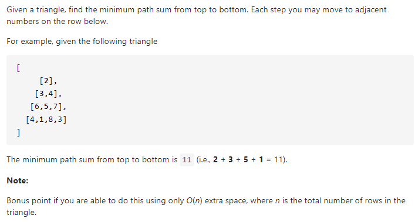

#### [120. Triangle](https://leetcode-cn.com/problems/triangle/)



---

刚开始想的动态规划是对的...不过有些边界没有理清楚, 导致了代码写起来很混乱, 最后还是看了题解才理清思路.


这个三角形是个等腰三角形, 我们可以将它左对齐:

```java
[[2],
 [3,4],
 [6,5,7],
 [4,1,8,3]]
```

由于我们只能选取相邻的数字, 也就是只能选取`j`或者`j+1`的数字, 我们可以轻松的得到`dp[i][j] = min(dp[i-1][j], dp[i-1][j-1]) + 当前的数字`, 这样我们就可以自顶向下的找到最小路径和了. 但是这里要处理边界问题, 首先当`j = 0`的时候, `dp[i-1][j-1]`并不存在, 而我们发现`j = 0`的时候, 当前的值只能由`dp[i-1][j]`来得到, 所以我们可以得到`dp[i][0] = dp[i-1][0] + 当前的数字`. 同理当`i = j`的时候, 也就是每行的最后一个数字, `dp[j-1][j]`不存在, 当前的`dp[i][j]`只能由`dp[i-1][j-1]`得来.

所以综上所述, 我们可以得到如下的式子:

```java
dp[i][0] = dp[i-1][0] + triangle.get(i).get(0);
dp[i][i] = dp[i-1][i-1] + triangle.get(i).get(i);
dp[i][j] = min(dp[i-1][j], dp[i-1][j-1]) + triangle.get(i).get(j);
```

最后我们的所有可能的最小路径和存储在dp数组的最后一行, 所以我们只需要在最后一行找到最小的就可以了.

java代码如下:

```java
class Solution {
    public int minimumTotal(List<List<Integer>> triangle) {
        int n = triangle.size();

        int[][] dp = new int[n][n];

        dp[0][0] = triangle.get(0).get(0);

        for (int i = 1; i < n; i++) {
            dp[i][0] = dp[i-1][0] + triangle.get(i).get(0);
            dp[i][i] = dp[i-1][i-1] + triangle.get(i).get(i);
            for (int j = 1; j < i; j++) {
                dp[i][j] = Math.min(dp[i-1][j], dp[i-1][j-1]) + triangle.get(i).get(j);
            }
        }

        int res = dp[n-1][0];
        for (int i = 1; i < n; i++) {
            res = Math.min(dp[n-1][i], res);
        }

        return res;

    }
}
```

---

这种自顶向下的方法比较麻烦, 这道题我们可以考虑自底向上的方法, 这样最终的结果就存储在了`dp[0][0]`了.

首先我们考虑状态转移方程, 很简单, 我们只需要将自顶向下的方程反过来即可:

`dp[i][j] = min(dp[i+1][j], dp[i+1][j+1]) + 当前的数字`, 此时i是从n-1开始的(自底向上).

```java
[[2],
 [3,4],
 [6,5,7],
 [4,1,8,3]]
```

然后我们来考虑边界问题, 当i在最底部的时候, 也就是`i = n`的时候, 我们的`dp[i][j]`就是当前的数字(`dp[3][0] = 4`).

所以我们可以将dp数组多加一行, 这样就不需要考虑边界了, 因为初始化的时候最后一行为0, 计算的时候就是`dp[i][j] = 0 + 当前的数字`.

因为`j + 1`一定存在, 所以我们不需要考虑它的边界问题.

java代码如下:
```java
class Solution {
    public int minimumTotal(List<List<Integer>> triangle) {
        int n = triangle.size();

        int[][] dp = new int[n+1][n+1];

        for (int i = n - 1; i >= 0; i--) {
            for (int j = 0; j <= i; j++) {
                dp[i][j] = Math.min(dp[i+1][j], dp[i+1][j+1]) + triangle.get(i).get(j);
            }
        }

        return dp[0][0];
    }
}
```

然后我们发现当前的状态都是由下一行的`dp[i+1][j]`和`dp[i+1][j+1]`来决定的, 所以可以进行空间优化.
java代码如下:
```java
class Solution {
    public int minimumTotal(List<List<Integer>> triangle) {
        int n = triangle.size();

        int[] dp = new int[n+1];

        for (int i = n - 1; i >= 0; i--) {
            for (int j = 0; j <= i; j++) {
                dp[j] = Math.min(dp[j], dp[j+1]) + triangle.get(i).get(j);
            }
        }

        return dp[0];
    }
}
```


