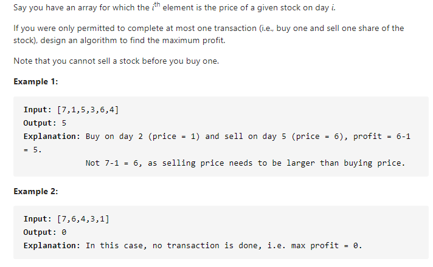

#### [121. Best Time to Buy and Sell Stock](https://leetcode-cn.com/problems/best-time-to-buy-and-sell-stock/)



---

这道题在数组那里记过了一次笔记, 但是没有写标准的动态规划方法, 在这里记录一下.

股票类型的问题可以套一个通用的动态规划模板, 来源于:https://labuladong.gitbook.io/algo/di-ling-zhang-bi-du-xi-lie/tuan-mie-gu-piao-wen-ti

```java
// k为交易次数
dp[i][k][0] = max(dp[i-1][k][0], dp[i-1][k][1] + prices[i])
              max(   选择 rest  ,             选择 sell      )

// 解释：今天我没有持有股票，有两种可能：
// 要么是我昨天就没有持有，然后今天选择 rest，所以我今天还是没有持有；
// 要么是我昨天持有股票，但是今天我 sell 了，所以我今天没有持有股票了。

dp[i][k][1] = max(dp[i-1][k][1], dp[i-1][k-1][0] - prices[i])
              max(   选择 rest  ,           选择 buy         )

// 解释：今天我持有着股票，有两种可能：
// 要么我昨天就持有着股票，然后今天选择 rest，所以我今天还持有着股票；
// 要么我昨天本没有持有，但今天我选择 buy，所以今天我就持有股票了。
    
// base case：
dp[-1][k][0] = dp[i][0][0] = 0
dp[-1][k][1] = dp[i][0][1] = -infinity

// 状态转移方程：
dp[i][k][0] = max(dp[i-1][k][0], dp[i-1][k][1] + prices[i])
dp[i][k][1] = max(dp[i-1][k][1], dp[i-1][k-1][0] - prices[i])
```

有了这个模板之后, 所有的股票问题就变得很简单了, 这里直接套用模板.

java代码如下:

```java
class Solution {
    public int maxProfit(int[] prices) {
        int n = prices.length;
        if (n < 1) {
            return 0;
        }

        // 0为未持有, 1为持有
        int[][] dp = new int[n + 1][2];
        dp[0][0] = 0;
        dp[0][1] = -prices[0];

        for (int i = 1; i < n; i++) {
            dp[i][0] = Math.max(dp[i - 1][0], dp[i - 1][1] + prices[i]);
            dp[i][1] = Math.max(dp[i - 1][1], -prices[i]);
        }

        return dp[n - 1][0];
    }
}
```

然后这种动态规划题都要看下空间是否能优化, 这里当前的状态只和前一个状态有关, 所以我们可以不使用dp数组, 只使用两个变量来记录状态.

java代码如下:

```java
class Solution {
    public int maxProfit(int[] prices) {
        int n = prices.length;
        if (n < 1) {
            return 0;
        }

        // 0为未持有, 1为持有
        int dp_i_0 = 0;
        int dp_i_1 = -prices[0];

        for (int i = 1; i < n; i++) {
            dp_i_0 = Math.max(dp_i_0, dp_i_1 + prices[i]);
            dp_i_1 = Math.max(dp_i_1, -prices[i]);
        }

        return dp_i_0;
    }
}
```


