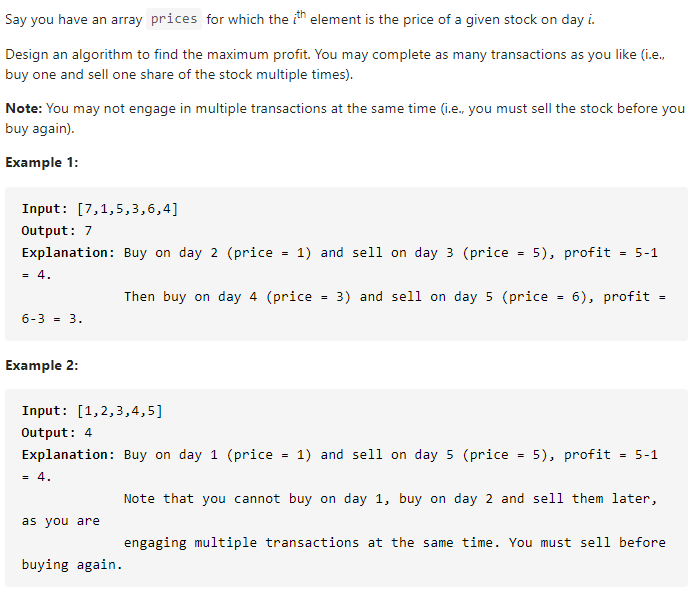

#### [122. Best Time to Buy and Sell Stock II](https://leetcode-cn.com/problems/best-time-to-buy-and-sell-stock-ii/)



---

这道题与121题一样, 直接套用模板即可, 因为不限次数, 所以k是没有区别的, 去掉即可.

java代码如下:

```java
class Solution {
    public int maxProfit(int[] prices) {
        int n = prices.length;
        if (n < 1) {
            return 0;
        }

        int[][] dp = new int[n + 1][2];
        dp[0][0] = 0;
        dp[0][1] = -prices[0];

        for (int i = 1; i < n; i++) {
            dp[i][0] = Math.max(dp[i-1][0], dp[i-1][1] + prices[i]);
            dp[i][1] = Math.max(dp[i-1][1], dp[i-1][0] - prices[i]);
        }

        return dp[n-1][0];
    }
}
```

---

优化空间代码如下:

```java
class Solution {
    public int maxProfit(int[] prices) {
        int n = prices.length;
        if (n < 1) {
            return 0;
        }

        int dp0 = 0;
        int dp1 = -prices[0];

        for (int i = 1; i < n; i++) {
            int temp = dp0;
            dp0 = Math.max(dp0, dp1 + prices[i]);
            dp1 = Math.max(dp1, temp - prices[i]);
        }

        return dp0;
    }
}
```

