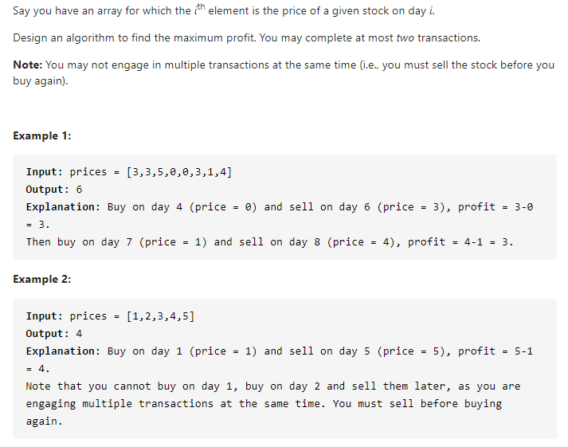

#### [123. Best Time to Buy and Sell Stock III](https://leetcode-cn.com/problems/best-time-to-buy-and-sell-stock-iii/)



---

继续套用大佬的模板...

```java
dp[i][k][0] = max(dp[i-1][k][0], dp[i-1][k][1] + prices[i])
dp[i][k][1] = max(dp[i-1][k][1], dp[i-1][k-1][0] - prices[i])
```

这里需要注意一点, 我们要穷举所有的k, 这道题的k=2, 所以要穷举k=2, k=1的情况.

java代码如下:

```java
class Solution {
    public int maxProfit(int[] prices) {
        int n = prices.length;
        if (n < 1) {
            return 0;
        }
        int maxK = 2;
        int[][][] dp = new int[n][maxK+1][2];

        for (int i = 0; i < n; i++) { 
            for (int k = maxK; k >= 1; k--) {
                if (i - 1 == -1) {
                    dp[i][k][0] = dp[i][0][0] = 0;
                    dp[i][k][1] = dp[i][0][1] = -prices[i];
                    continue;
                }
                dp[i][k][0] = Math.max(dp[i-1][k][0], dp[i-1][k][1] + prices[i]);
                dp[i][k][1] = Math.max(dp[i-1][k][1], dp[i-1][k-1][0] - prices[i]);
            }
        }

        return dp[n-1][maxK][0];
    }
}
```

因为这道题的k=2, 比较小, 所以我们可以进行空间优化

```java
class Solution {
    public int maxProfit(int[] prices) {
        int n = prices.length;
        if (n < 1) {
            return 0;
        }
        
        int dp_i10 = 0, dp_i20 = 0;
        int dp_i11 = -prices[0], dp_i21 = -prices[0];

        for (int price : prices) {
            dp_i20 = Math.max(dp_i20, dp_i21 + price);
            dp_i21 = Math.max(dp_i21, dp_i10 - price);
            dp_i10 = Math.max(dp_i10, dp_i11 + price);
            dp_i11 = Math.max(dp_i11, -price);
        }

        return dp_i20;
    }
}
```

