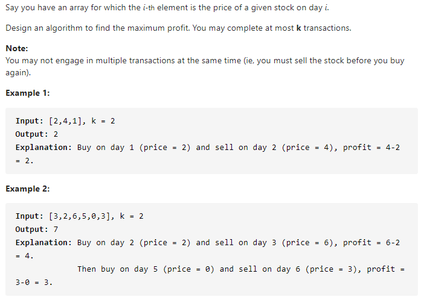

#### [188. Best Time to Buy and Sell Stock IV](https://leetcode-cn.com/problems/best-time-to-buy-and-sell-stock-iv/)



---

这道题和123题是一样的, 不过这个k是一个正整数. 所以可以直接套用模板进行解.

不过提交的时候报错了, 超出内存限制. 这是因为k可能非常大, 所以导致dp数组变得非常大, 我们要进行优化.

如何优化呢? 我们发现每两次操作会使k-1, 也就是买入卖出构成一次交易, 此时k-1. 所以有效的k限制应当不超过n/2, 如果超过了说明我们进行多少次交易都是没问题的, 相当于k=+inf, 也就是回到了122题的解法, 在这里我们可以直接写一个函数来实现122题的解法.

java代码如下:

```java
class Solution {
    public int maxProfit(int k, int[] prices) {
        int n = prices.length;
        
        if (n < 1) {
            return 0;
        }
		
        // 此时相当于k=+inf, 也就是没有次数限制
        if (k > n / 2) {
            return maxProfit_int(n, prices);
        }

        int max_k = k;
        int[][][] dp = new int[n][k+1][2];

        for (int i = 0; i < n; i++) {
            for (int j = max_k; j >= 1; j--) {
                if (i - 1 == -1) {
                    dp[i][j][0] = dp[i][0][0] = 0;
                    dp[i][j][1] = dp[i][0][1] = -prices[0];
                    continue;
                }
                dp[i][j][0] = Math.max(dp[i-1][j][0], dp[i-1][j][1] + prices[i]);
                dp[i][j][1] = Math.max(dp[i-1][j][1], dp[i-1][j-1][0] - prices[i]);
            }
        }

        return dp[n-1][k][0];
    }
    
	// 122题的解法
    private int maxProfit_int(int n, int[] prices) {
        int dp_0_0 = 0;
        int dp_0_1 = -prices[0];

        for (int price : prices) {
            int temp = dp_0_0;
            dp_0_0 = Math.max(dp_0_0, dp_0_1 + price);
            dp_0_1 = Math.max(dp_0_1, temp - price);
        }

        return dp_0_0;
    }
}
```


