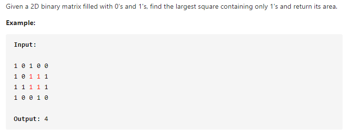
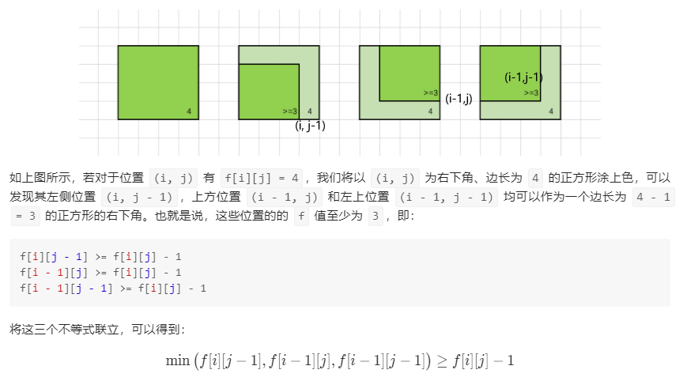

#### [221. Maximal Square](https://leetcode-cn.com/problems/maximal-square/)



---

动态规划题先找状态转移.

这道题的是找最大的正方形面积, 我们可以找构成最大正方形的右下角的点. 以右下角作为dp数组的状态, 这里存储的是正方形最大的边长.

假设当前的`dp[i][j]`构成最大的正方形, 它的值从哪里来的呢? 也就是状态是从哪转移过来的呢? 

这里官方题解给出的证明非常的简单易懂, 我这里直接贴出来再解释.



首先我们假设我们当前的`dp[i][j]`达到了4(这里4为正方形边长, 我们只需要找到最大边长就能找到最大面积), 如果这样的话, 那么`dp[i-1][j],dp[i][j-1],dp[i-1][j-1]`一定有大于等于3的边长, 如图所示. 所以我们可以得出这个不等式`min(dp[i-1][j],dp[i][j-1],dp[i-1][j-1]) >= dp[i][j] - 1`.

根据这个不等式我们就可以得到我们需要的状态转移方程: `dp[i][j] = min(dp[i-1][j],dp[i][j-1],dp[i-1][j-1]) + 1`.

然后我们需要考虑初始化的问题. 首先当当前数字为0的时候我们是不考虑的, 可以直接跳过, 因为它构不成正方形. 当`i = 0`的时候, 我们只在一条边上, 此时没有`i - 1`, 所以最大的正方形只能为1, 同理, `j = 0`的时候也一样. 这样我们就完成了初始化的工作.

同时我们要有一个变量记录最大边长, 因为我们计算dp的时候是找最大边长, 这个边长可能出现在dp数组的开头, 中间或者尾部, 我们不能确定最大边长的位置, 所以要用一个变量来记录.

java代码如下:

```java
class Solution {
    public int maximalSquare(char[][] matrix) {
        int maxSide = 0;
        
        if (matrix == null || matrix.length == 0 || matrix[0].length == 0) {
            return 0;
        }
        int row = matrix.length;
        int col = matrix[0].length;


        int[][] dp = new int[row][col];

        for (int i = 0; i < row; i++) {
            for (int j = 0; j < col; j++) {
                if (matrix[i][j] == '1') {
                    if (i == 0 || j == 0) {
                        dp[i][j] = 1;
                    } else {
                        dp[i][j] = Math.min(Math.min(dp[i-1][j], dp[i][j-1]), dp[i-1][j-1]) + 1;
                    }
                    maxSide = Math.max(dp[i][j], maxSide);
                }
            }
        }

        return maxSide * maxSide;
    }
}
```

