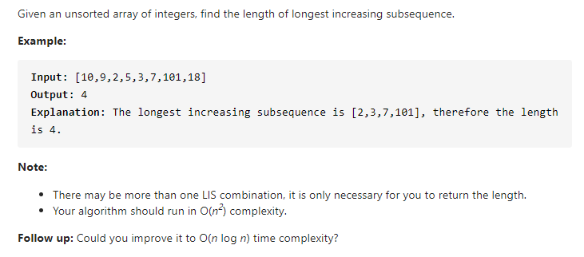

#### [300. Longest Increasing Subsequence](https://leetcode-cn.com/problems/longest-increasing-subsequence/)



---

这道题有两种解法, 暂时先用动态规划解. 二分查找的方法可以达到`O(n log n)`的复杂度, 但是有点难想到, 比较难理解.

>**动态规划**

首先考虑状态转移. 我们先使用一个dp数组来存储当前i的最长的递增子序列长度, 假设当前已知`dp[0...i-1]`, 需要求`dp[i]`.

`dp[i]`要如何求呢? 假设我们当前的`nums[i] = 3`, 我们只需要找到比3小的`nums[j]`, 然后`dp[j]`就为比3小的最长子序列长度, 所以只要将`dp[j] + 1`, 这样我们就得到了一个新的递增子序列. 但是我们只要最长的, 所以只需把它与当前的`dp[i]`比较一下即可.

最后我们的dp数组中存有当前i对应的最长子序列, 所以我们只需要找出最大的那个返回即可.

别忘了考虑初始化的问题, 因为最长的递增子序列最短也是1, 也就是它本身, 所以将dp数组全部初始化为1.

java代码如下:

```java
class Solution {
    public int lengthOfLIS(int[] nums) {
        int n = nums.length;
        if (n == 0) {
            return 0;
        }

        int[] dp = new int[n];
        Arrays.fill(dp, 1);

        for (int i = 0; i < n; i++) {
            for (int j = 0; j < i; j++) {
                if (nums[j] < nums[i]) {
                    dp[i] = Math.max(dp[i], dp[j] + 1);
                }
            }
        }

        int res = 0;
        for (int temp : dp) {
            res = Math.max(res, temp);
        }

        return res;
    }
}
```


