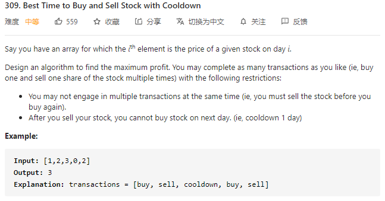
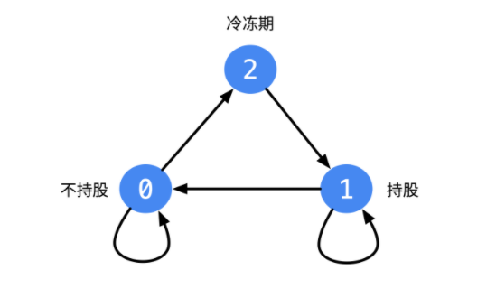

#### [309. Best Time to Buy and Sell Stock with Cooldown](https://leetcode-cn.com/problems/best-time-to-buy-and-sell-stock-with-cooldown/)



---

先吹爆一下liweiwei大佬, 题解写的太好了, 简单生动形象, 链接在此:https://leetcode-cn.com/problems/best-time-to-buy-and-sell-stock-with-cooldown/solution/dong-tai-gui-hua-by-liweiwei1419-5/

然后回到这道题, 看了眼大佬的状态转移图, 瞬间思路清晰了起来.



定义三个状态, 0表示不持股, 1表示持股, 2表示冷冻期, 冷冻期只能由不持股的状态转化过来. 同时持股状态和不持股状态可以保持不变. 然后进行状态的初始化, 起初, 不持股初始化为0, 因为刚开始不持股无利润, 持股初始化为`-prices[0]`, 因为如果刚开始买入股票利润为`-prices[0]`, 冷冻期初始化为0, 刚开始的冷冻期利润为0.

最终的结果为不持股和冷冻期的最大值, 最优值在最后一天, 因为当前状态都由之前的状态转化而来.

java代码如下:

```java
class Solution {
    public int maxProfit(int[] prices) {
        int n = prices.length;

        if (n < 2) {
            return 0;
        }

        int[][] dp = new int[n][3];
		
        // 我这里写成了0为持股, 1为不持股
        dp[0][0] = -prices[0];
        dp[0][1] = 0;
        dp[0][2] = 0;

        for (int i = 1; i < n; i++) {
            dp[i][0] = Math.max(dp[i-1][0], dp[i-1][2] - prices[i]);
            dp[i][1] = Math.max(dp[i-1][1], dp[i-1][0] + prices[i]);
            dp[i][2] = dp[i-1][1];
        }

        return Math.max(dp[n-1][1], dp[n-1][2]);
    }
}
```

---

空间优化:

由于当前的状态只和昨天的状态有关, 所以我们可以将dp数组优化到`[2][3]`. 可以用滚动数组进行优化.

```java
class Solution {
    public int maxProfit(int[] prices) {
        int n = prices.length;

        if (n < 2) {
            return 0;
        }

        int[][] dp = new int[2][3];

        dp[0][0] = -prices[0];
        dp[0][1] = 0;
        dp[0][2] = 0;
		
        // i & 1会在0和1之间不停的切换, 初始值为1
        for (int i = 1; i < n; i++) {
            dp[i & 1][0] = Math.max(dp[(i-1) & 1][0], dp[(i-1) & 1][2] - prices[i]);
            dp[i & 1][1] = Math.max(dp[(i-1) & 1][1], dp[(i-1) & 1][0] + prices[i]);
            dp[i & 1][2] = dp[(i-1) & 1][1];
        }

        return Math.max(dp[(n-1) & 1][1], dp[(n - 1) & 1][2]);
    }
}
```

---

还可以继续优化, 由于我们只关心最后一天的状态值, 所以可以将dp数组优化成一行.

```java
class Solution {
    public int maxProfit(int[] prices) {
        int n = prices.length;

        if (n < 2) {
            return 0;
        }

        int[] dp = new int[3];

        dp[0] = -prices[0];
        dp[1] = 0;
        dp[2] = 0;
        
        int preCash = dp[1];
        int preStock = dp[0];

        for (int i = 1; i < n; i++) {
            dp[0] = Math.max(preStock, dp[2] - prices[i]);
            dp[1] = Math.max(preCash, preStock + prices[i]);
            dp[2] = preCash;
            
            preCash = dp[1];
            preStock = dp[0];
        }

        return Math.max(dp[1], dp[2]);
    }
}
```


> 再次吹一下liweiwei大佬, tql

