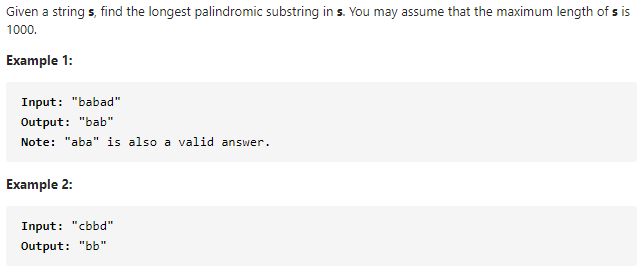

#### [5. Longest Palindromic Substring](https://leetcode-cn.com/problems/longest-palindromic-substring/)



---

开始进行动态规划的练习了, 先来一道最经典的动态规划题, 最长的回文子串.

> 看了liweiwei大佬的题解, 醍醐灌顶, 感觉把每个地方都说的很清楚, 我自己写的题解很烂...在这里给个liweiwei大佬题解的链接:https://leetcode-cn.com/problems/longest-palindromic-substring/solution/zhong-xin-kuo-san-dong-tai-gui-hua-by-liweiwei1419/

1. 动态规划解法

首先我们找状态转移方程. 根据回文串的定义, 一个回文串去头去尾, 剩余的部分也一定是一个回文串, `s[i...j]`为回文串, 那么`s[i + 1...j - 1]`也一定是回文串. 所以我们可以使用一个dp数组来记录`s[i + 1...j - 1]`的状态. 因为是子串, 所以一定有`i <= j`.
由此我们可以得到一个状态转移方程`dp[i][j] = s[i] == s[j] and dp[i + 1][j - 1]`.
然后我们考虑边界条件, 当字符串长度为3的时候, 头尾两个字符相等, 那么这个字符串一定是回文串, 所以我们可以得出`j - 1 + 1 < 3`的时候, 字符串一定是回文串`dp[i][j] = true`.
然后在输出最终结果的时候, 我们只需要记录之前的最大的子串长度还有开始位置就可以了, 这样可以节省下截取字符串和存储的时间.

java代码如下:
```java
class Solution {
    public String longestPalindrome(String s) {
        int n = s.length();

        if (n < 2) {
            return s;
        }

        boolean[][] dp = new boolean[n][n];
        int maxLen = 1;
        int begin = 0;
        char[] c = s.toCharArray();
		
		// 因为计算当前状态需要dp[i+1][j-1]的状态, 所以要从j开始
        for (int j = 1; j < n; j++) {
            for (int i = 0; i < j; i++) {
                if (c[i] != c[j]) {
                    dp[i][j] = false;
                } else {
                    if (j - i < 3) {
                        dp[i][j] = true;
                    } else {
                        dp[i][j] = dp[i + 1][j - 1];
                    }
                }

                if (dp[i][j] && j - i + 1 > maxLen) {
                    begin = i;
                    maxLen = j - i + 1;
                }
            }
        }

        return s.substring(begin, begin + maxLen);
    }
}
```


2. 中心扩散法

中心扩散法的思想为选中一个字符, 然后从当前字符向两边扩展, 如果两边的字符相等, 那么当前的子串是一个回文串, 不相等的话就不是. 这里存在一个奇偶性的问题.


这里借用一下liweiwei大佬的图来解释一下这个问题.

所以为了解决这个问题我们需要构建两个字符串, 一个为奇数长度, 一个为偶数长度.

- 当我们传入的left和right都为当前index的时候, 该字符串扩散完为奇数.

- 当我们传入的left为当前index, right为index+1, 该字符串扩散完为偶数.

java代码如下:

```java
class Solution {
    public String longestPalindrome(String s) {
        int n = s.length();

        if (n < 2) {
            return s;
        }

        String res = s.substring(0, 1);
        int maxLen = 1;

        for (int i = 0; i < n; i++) {
            String oddstr = centerSpread(s, i, i);
            String evenstr = centerSpread(s, i, i + 1);
            String maxstr = oddstr.length() > evenstr.length() ? oddstr : evenstr;

            if (maxstr.length() > maxLen) {
                maxLen = maxstr.length();
                res = maxstr;
            }
        }
        return res;
    }

    private String centerSpread(String s, int left, int right) {
        int len = s.length();
        while (left >= 0 && right < len) {
            if (s.charAt(left) == s.charAt(right)) {
                left--;
                right++;
            } else {
                break;
            }
        }

        return s.substring(left + 1, right);
    }
}
```


