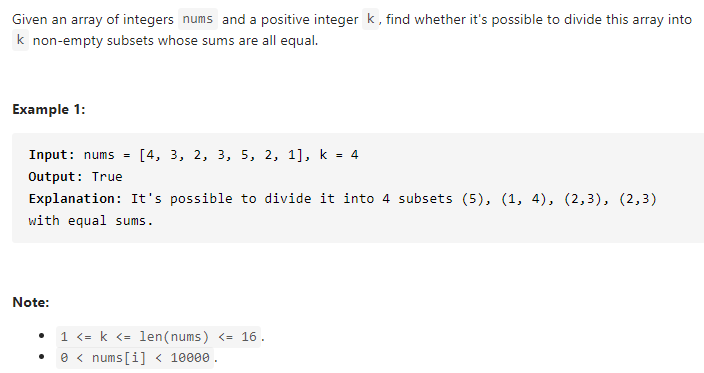

#### [698. Partition to K Equal Sum Subsets](https://leetcode-cn.com/problems/partition-to-k-equal-sum-subsets/)



---

本来看到标签是动态规划想用dp来解, 后来发现不是很好理解, 就放弃了, 转而采用了回溯法来解.

直接上代码了, java代码如下:

```java
class Solution {
    public boolean canPartitionKSubsets(int[] nums, int k) {
        // 求和
        int sum = Arrays.stream(nums).sum();
        // 如果数组的总和不能被k整除, 说明不存在恰好可以分成k组的subset
        if (sum % k != 0) {
            return false;
        }
		
        // target为subset的和
        int target = sum / k;
        // 排序减少一些操作, 可以直接判断最大的数字是否满足条件
        Arrays.sort(nums);
        int index = nums.length - 1;

        // 判断最大的数字是否大于target, 如果大于, 说明结果不存在
        if (nums[index] > target) {
            return false;
        }

        // 如果当前的数字自身就可以满足target, 跳过它
        while (index >= 0 && nums[index] == target) {
            index--;
            k--;
        }
		// 进行回溯
        return backtrack(index, new int[k], nums, target);
    }

    private boolean backtrack(int index, int[] groups, int[] nums, int target) {
        // 全部遍历完成, 满足条件返回true
        if (index < 0) {
            return true;
        }

        int value = nums[index];
		
        // 对于每个subset来进行判断
        for (int i = 0; i < groups.length; i++) {
            // 当前的subset和小于等于target
            if (groups[i] + value <= target) {
                // 当前的subset加上当前的value
                groups[i] += value;
                // 进行下一个数的判断
                if (backtrack(index - 1, groups, nums, target)) {
                    return true;
                }
                // 返回到上一个状态
                groups[i] -= value;
            }
            // 优化时间 跳过一些状态 (没太想明白)
            if (groups[i] == 0) {
                break;
            }
        }

        return false;
    }
}
```

