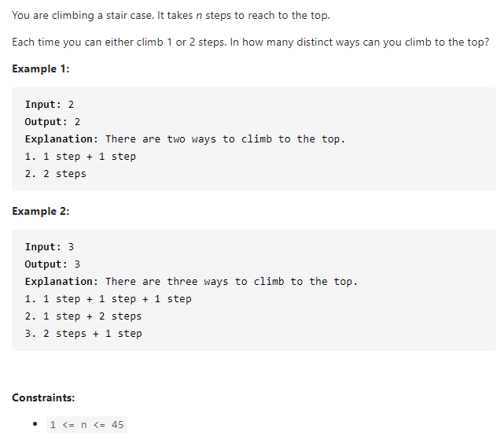

#### [70. Climbing Stairs](https://leetcode-cn.com/problems/climbing-stairs/)



---

动态规划的题, 首先找状态转移.

当我们爬第n阶台阶的时候, 可以由两个状态得来, 第一种是前n-1个台阶再爬一阶可以到n, 第二种是前n-2个台阶再爬两阶可以到n,  所以爬第n阶楼梯的方法数量等于两部分之和, 状态转移方程为`dp[n] = dp[n - 1] + dp[n - 2]`.

同时需要初始化`dp[0] = 1, dp[1] = 2`.

java代码如下:

```java
class Solution {
    public int climbStairs(int n) {
        if (n <= 2) {
            return n;
        }

        int[] dp = new int[n];
        dp[0] = 1;
        dp[1] = 2;

        for (int i = 2; i < n; i++) {
            dp[i] = dp[i - 1] + dp[i - 2];
        }

        return dp[n - 1];
    }
}
```

