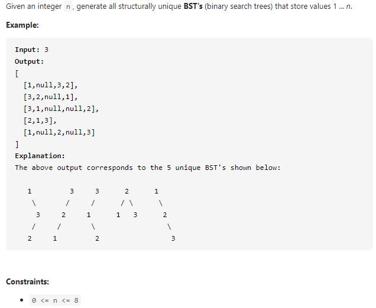

#### [95. Unique Binary Search Trees II](https://leetcode-cn.com/problems/unique-binary-search-trees-ii/)



---

这道题刚开始看跟96题很像, 只不过这道题需要输出所有的树. 起初想使用动态规划的时候没有很好的思路, 树的题一般都递归有关, 看了下题解, 写了一下递归的思路, 动态规划的思路还是有点没太理解...

递归思路就比较简单了, 首先我们考虑如何构建一个二叉搜索树, 我们需要先选择一个根节点i, 然后递归的去构建, 左子树为`(start, i - 1)`, 右子树为`(i, end - 1)`. 如果要构建多个二叉搜索树, 只需要变动i就可以, 将i从start到end进行遍历.

题中我们需要返回一个list, 所以最后将构建的树加入到list中即可. 具体的解释见代码注释.

java代码如下:

```java
class Solution {
    public List<TreeNode> generateTrees(int n) {
        if (n < 1) {
            return new ArrayList<>();
        }

        return helper(1, n);
    }

    private List<TreeNode> helper(int start, int end) {
        List<TreeNode> list = new ArrayList<>();

        // 如果当前的start >= end, 说明左子树或者右子树为空,
        // 如果不加这个null, 会导致list遍历的时候无法遍历.
        if (start > end) {
            list.add(null);
            return list;
        }

        for (int i = start; i <= end; i++) {
            // 拿到所有的左子树和右子树
            List<TreeNode> left = helper(start, i - 1);
            List<TreeNode> right = helper(i + 1, end);

            // 固定左子树, 然后遍历右子树, 将所有的结果加入到list
            for (TreeNode l : left) {
                for (TreeNode r : right) {
                    TreeNode root = new TreeNode(i);
                    root.left = l;
                    root.right = r;
                    list.add(root);
                }
            }           
        }

        return list;
    }
}
```


>下面预留给动态规划解法, 等我研究会了再来补上