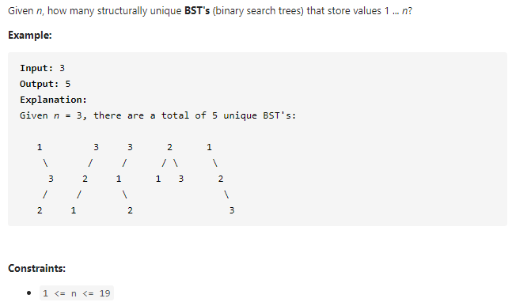

#### [96. Unique Binary Search Trees](https://leetcode-cn.com/problems/unique-binary-search-trees/)



---

这道题需要找一个规律...

首先假设n个节点存在二叉搜索树的个数为`G(n)`, 然后设`f(i)`为以i为根的二叉搜索树的个数, 则有:

`G(n) = f(1) + f(2) + f(3) + ... + f(n)`

当i为根节点的时候, 有`f(i) = G(i-1) * G(n-i)`, 左子树为`i-1`个, 右子树为`n-i`个, 当左子树为`i-1`个的时候, 有`G(i-1)`种情况, 当右子树为`n-i`个的时候, 有`G(n-i)`种情况, 两者相乘即为`f(i)`的总子树个数.

这两个公式相结合后就变为:`G(n) = G(0)*G(n-1) + G(1)*G(n-2) + G(2)*G(n-3) + ... + G(n-1)*G(0)`. 这个有个高大上的名字叫卡特兰数公式...

代码就比较好写了

java代码如下:

```java
class Solution {
    public int numTrees(int n) {
        int[] dp = new int[n + 1];

        dp[0] = dp[1] = 1;
        
		// 每一种情况都要计算进去, 比如当前的n为3
        // 就要计算1为根, 2为根, 3位根的子树个数和
        for (int i = 2; i <= n; i++) {
            for (int j = 1; j <= i;j++) {
                dp[i] += dp[j-1] * dp[i-j];
            }
        }
        return dp[n];
    }
}
```


