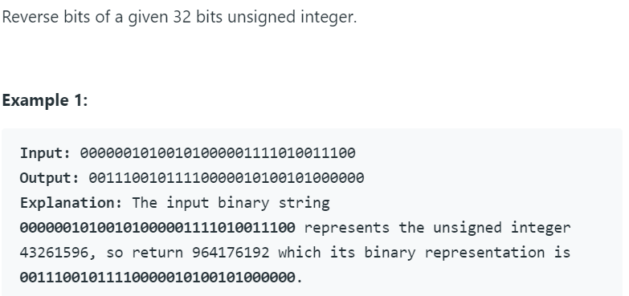

# 190. Reverse Bits




本题思路为伪双指针。利用python中的位运算，将末尾的数字提取出来，然后再将该数字赋值给另一个变量。利用位运算移到下一位。

python代码如下：

```python
class Solution:
    # @param n, an integer
    # @return an integer
    def reverseBits(self, n):
        result = 0
        for i in range(32):
            result = (result << 1) + (n & 1)
            n >>= 1
        return result
```

