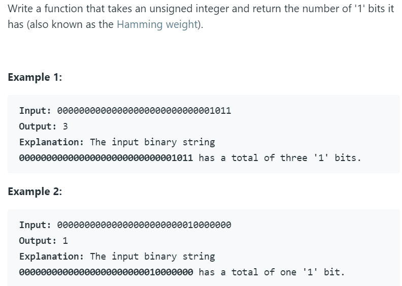

# 191. Number of 1 Bits



---

这道题首先我想到的是位运算。即将n与1做与运算，如果为1，则说明最后一位为1，此时计数器加一。

Python代码如下：

```python
class Solution(object):
    def hammingWeight(self, n):
        """
        :type n: int
        :rtype: int
        """
        count = 0
        for i in range(32):
            if n & 1 == 1:
                count += 1
                n >>= 1
            else:
                n >>= 1
        return count
```


#### 另一种更巧妙的方法

官方给出了一种更加巧妙的方法。

计算`n = n & (n - 1)`直到`n=0`，说明没有一个1了。复杂度均为O(1)。

原理如下：


实现起来很简单，python代码如下：

```python
class Solution(object):
    def hammingWeight(self, n):
        """
        :type n: int
        :rtype: int
        """
        count = 0
        while(n):
            n &= (n - 1)
            count += 1 
        return count
```

