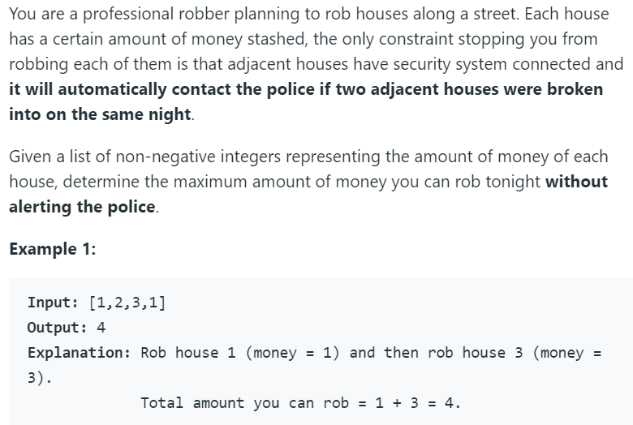

# 198. House Robber




此题思路很明确，使用动态规划

首先从最简单的情况开始考虑起：

f(k)=从前k个房屋中能抢到的最大数额，An为当前房屋的数额。

`n=1`的情况，f(1)=A1。

`n=2`的情况也很简单，f(2)=max(A1,A2)。

`n=3`的情况有两个选项：

1. 抢第三个房子，然后将其与第一个房子的数额相加。
2. 不抢第三个房子，保持目前的最大数额f(2)。

于是，可以得到状态转移方程：`f(k) = max(f(k-2)+Ak, f(k-1))`。

f(k-2)为之前的最大数额，f(k-1)为目前的最大数额。

python代码如下：

```python
class Solution(object):
    def rob(self, nums):
        """
        :type nums: List[int]
        :rtype: int
        """
        if not nums:
            return 0
        if len(nums) == 1:
            return nums[0]
        else:
            premax = nums[0]
            curmax = max(premax, nums[1])
            for i in range(2, len(nums)):
                curmax, premax = max(premax + nums[i], curmax), curmax
        return curmax
```

