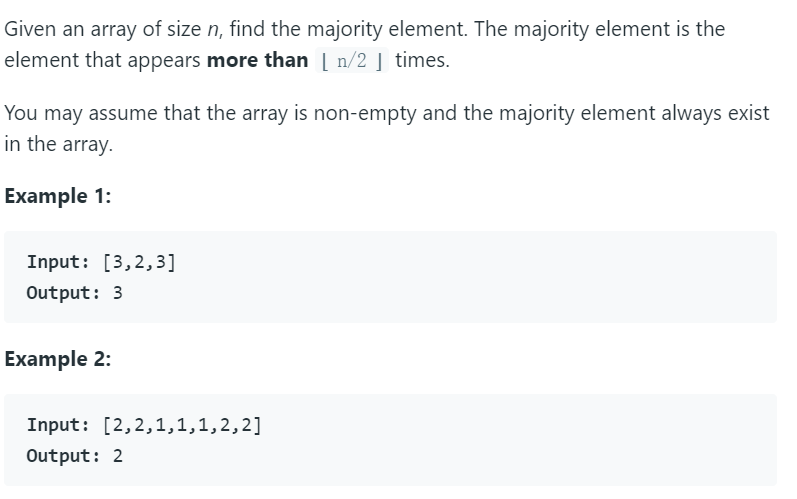

# 169. Majority Element



#### 第一种解法：Hash Map

思路很简单，将所有数字存到字典中，然后计数，返回次数最多的那个数字。复杂度都为O(n)。

python代码如下：

```python
class Solution:
    def majorityElement(self, nums: List[int]) -> int:
        major = {}
        for num in nums:
            if num not in major:
                major[num] = 1
            else:
                major[num] += 1
        return max(major, key=major.get)
    
    #简化版，可以使用collections.Counter()
class Solution:
    def majorityElement(self, nums):
        counts = collections.Counter(nums)
        return max(counts.keys(), key=counts.get)
```


#### 第二种解法：排序

将一个数组排序，中间的数字就是出现最多的数字，因为出现次数必须大于n/2才算最多。

python代码如下：

```python
class Solution:
    def majorityElement(self, nums):
        nums.sort()
        return nums[len(nums)//2]
```


#### 第三种解法：投票算法

思路是将第一个值设为候选人，同时开启一个计数器，如果下一个数与候选人相等的话，计数器加1，否则减-1。如果计数器为0，则将下一个值设为候选人。重复此循环，最后的候选人就是众数。

原理摘自leetcode官方

[7, 7, 5, 7, 5, 1 | 5, 7 | 5, 5, 7, 7 | 7, 7, 7, 7]

首先，下标为 0 的 7 被当做众数的第一个候选。在下标为 5 处，计数器会变回0 。所以下标为 6 的 5 是下一个众数的候选者。由于这个例子中 7 是真正的众数，所以通过忽略掉前面的数字，我们忽略掉了同样多数目的众数和非众数。因此， 7 仍然是剩下数字中的众数。

[7, 7, 5, 7, 5, 1 | 5, 7 | 5, 5, 7, 7 | 5, 5, 5, 5]

现在，众数是 5 （在计数器归零的时候我们把候选从 7 变成了 5）。此时，我们的候选者并不是真正的众数，但是我们在 遗忘 前面的数字的时候，要去掉相同数目的众数和非众数（如果遗忘更多的非众数，会导致计数器变成负数）。

因此，上面的过程说明了我们可以放心地遗忘前面的数字，并继续求解剩下数字中的众数。最后，总有一个后缀满足计数器是大于 0 的，此时这个后缀的众数就是整个数组的众数。

python代码如下：

```python
class Solution:
    def majorityElement(self, nums: List[int]) -> int:
        count, major = 0, None
        for num in nums:
            if count == 0:
                major = num
            count += (1 if num == major else -1)        
        return major
```


