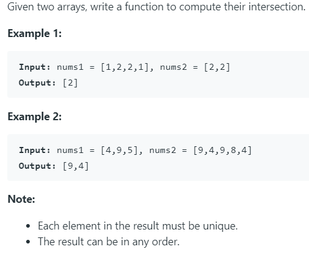

# 349. Intersection of Two Arrays



很简单的一道题。很容易想到遍历然后将一个数组存到字典中，再用另一个数组查询是否在字典中，完成查找重复元素。

但是我写的方法很慢。这里有个小技巧：将字典的键值赋值为同一个数值，这样当下一次存一样的元素的时候，会将字典中原来的值覆盖掉，保证字典中的值唯一，这样就不用判断元素是否在字典中了。

同时，查询完元素后，如果发现相同元素，将其加入最终返回列表，并将其从字典中pop出，这样下次查询会少查一个元素，节省时间。

在试图更改我的方法时（向最终列表加入元素后，将其从字典中pop出），编译报错，得知字典类型在迭代的时候size不能改变。

------

另一种方法是利用python中的set。

set函数返回一个无序不重复的元素集。所以利用这个特性可以得到

```python
set(x) & set(y) # 交集
set(x) | set(y) # 并集
set(x) - set(y) # 差集
```

 

python代码如下：

```python

class Solution:
    def intersection(self, nums1: List[int], nums2: List[int]) -> List[int]:
        '''
        final = {}
        final_list = []
        for i in range(len(nums1)):
            if nums1[i] in nums2 and nums1[i] not in final:
                final[nums1[i]] = i
                
        for num in final:
            final_list.append(num)
            # final.pop(num)
            
        return final_list
        '''
        
        # return set(nums1) & set(nums2)
        
        visited, final = {}, []
        
        for num in nums1:
            visited[num] = num
            
        for num in nums2:
            if num in visited:
                final.append(num)
                visited.pop(num)
        return final
```


