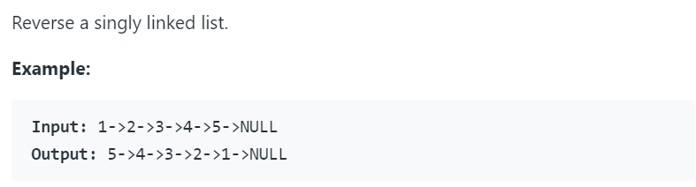

# 206. Reverse Linked List




链表基本操作，python代码如下：

```python
class Solution(object):
    def reverseList(self, head):
        """
        :type head: ListNode
        :rtype: ListNode
        """
        '''
        pre = None
        cur = head
        while(cur):
            cur.next, pre, cur = pre, cur, cur.next
        return pre
        '''
        L = ListNode(0)
        while(head):
            L.next, head.next, head = head, L.next, head.next
        return L.next
```


这里的L是指向一个新建的结点，因为python没有指针的概念，所以用一个额外的结点来代替头指针，这里的核心代码就是中间那一行三个变量的连续赋值，如果单独一句句来理解的话，最后肯定是想不通的，在这里，假设head结点是链表串’1->2->3->4’的头结点，先用新的L结点的next指针指向head的第一个结点‘1’，之后将L.next(第一次也就是空)赋给了head的next指针，之后再把head的next指针（注意，这里的next指针还是指向‘2’的，而不是空）赋给head，相当于next向前移一位，这一步相当于一个串变成了两个：

L：‘-inf’->‘1’
head：‘2’->‘3’->‘4’->‘5’
————————————————
版权声明：本文为CSDN博主「木子天一」的原创文章，遵循 CC 4.0 BY-SA 版权协议，转载请附上原文出处链接及本声明。
原文链接：https://blog.csdn.net/xjcvip007/article/details/54348245


主要需要搞清楚链表的指针域到底指的是什么。比如L.next = head 这句话是指将L与head连接，也就是将None与1相连。而head.next = L.next是指将1.next赋值为None，也就是第一串最后指向None。然后将head.next赋值给head，也就是将2作为head。