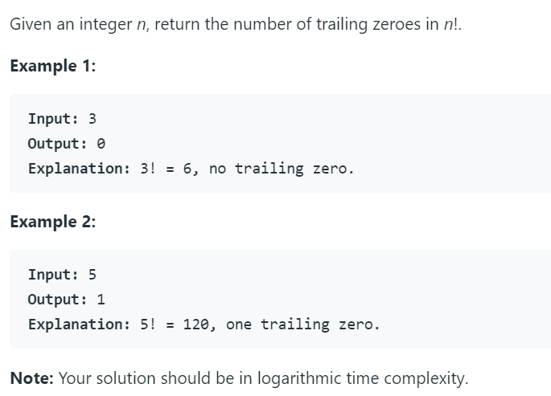

# 172. Factorial Trailing Zeroes




首先这道题考虑的是阶乘末尾0的个数。可以发现只有2×5的末尾会出现0，而因式分解之后2的个数会非常多，所以只计算5的个数，5的个数即为末尾0的个数。另一个问题是当阶乘中包括5的倍数的时候，比如说30！，其中就会包含7个5，因为25中含有两个5。最后可以得到f(n) = n/5 + n/25 + n/75 +...+ n/5^n，相当于f(n) = n/5 + (n/5)/5 +...。

python代码如下：

```python
class Solution:
    def trailingZeroes(self, n: int) -> int:
        count = 0
        while n >= 5:
            n = n // 5
            count += n
        return count
    #递归
    def trailingZeroes(self, n: int) -> int:
        if n == 0:
            return 0
        else:
            return n // 5 + self.trailingZeroes(n // 5)
```

