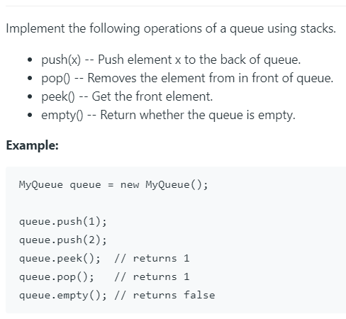

# 232. Implement Queue using Stacks




这道题用双栈来实现队列会快很多。在push的时候使用双栈。


原理如上。

python代码如下:

```python
class MyQueue(object):

    def __init__(self):
        """
        Initialize your data structure here.
        """
        self.s1 = []
        self.s2 = []
        
    def push(self, x):
        """
        Push element x to the back of queue.
        :type x: int
        :rtype: None
        """
        while self.s1:
            self.s2.append(self.s1.pop())
        self.s2.append(x)
        
        while self.s2:
            self.s1.append(self.s2.pop())
            

    def pop(self):
        """
        Removes the element from in front of queue and returns that element.
        :rtype: int
        """
        return self.s1.pop()

    def peek(self):
        """
        Get the front element.
        :rtype: int
        """
        return self.s1[-1]

    def empty(self):
        """
        Returns whether the queue is empty.
        :rtype: bool
        """
        return not self.s1


# Your MyQueue object will be instantiated and called as such:
# obj = MyQueue()
# obj.push(x)
# param_2 = obj.pop()
# param_3 = obj.peek()
# param_4 = obj.empty()

# 我写的方法
class MyQueue(object):

    def __init__(self):
        """
        Initialize your data structure here.
        """
        self.obj = []

    def push(self, x):
        """
        Push element x to the back of queue.
        :type x: int
        :rtype: None
        """
        self.obj.append(x)

    def pop(self):
        """
        Removes the element from in front of queue and returns that element.
        :rtype: int
        """
        return self.obj.pop(0)

    def peek(self):
        """
        Get the front element.
        :rtype: int
        """
        return self.obj[0]

    def empty(self):
        """
        Returns whether the queue is empty.
        :rtype: bool
        """
        return not self.obj


# Your MyQueue object will be instantiated and called as such:
# obj = MyQueue()
# obj.push(x)
# param_2 = obj.pop()
# param_3 = obj.peek()
# param_4 = obj.empty()
```


