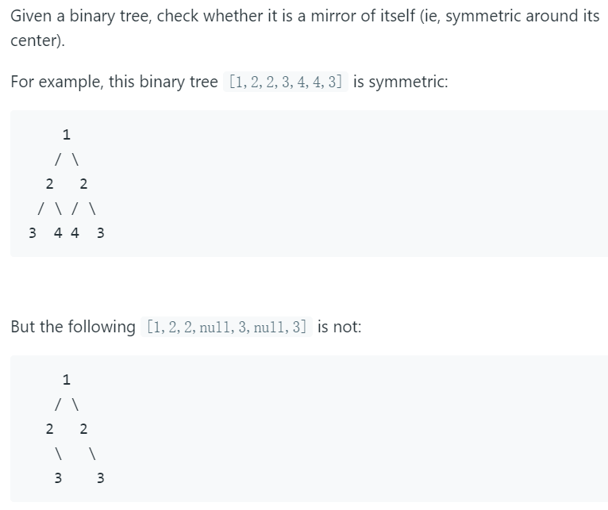

# 101. Symmetric Tree




寻找对称树。使用BFS可以解决。有递归和迭代两种方法。

BFS的大致思想为采用一个队列（先进先出）来存储访问的元素。从根节点出发，将左右子节点按从左到右加入的队列中，遍历的时候将头部元素（第一个加入的左节点）pop出，然后将被pop的节点的左右节点加入队列。这样重复，从左到右，从上到下。

如果左节点的右值与右节点的左值相等，左节点左值与右节点右值相等，那么到这个节点为止，树是对称的。


python代码如下：

```python
# Definition for a binary tree node.
# class TreeNode:
#     def __init__(self, x):
#         self.val = x
#         self.left = None
#         self.right = None

class Solution:
    def isSymmetric(self, root: TreeNode) -> bool:
        if not root:
            return True
        
        # return self.Sym(root.left, root.right)
        
        queue = []
        queue.append(root.left)
        queue.append(root.right)
        
        while queue:
            left = queue.pop(0)
            right = queue.pop(0)
            
            if not left and not right:
                continue
                
            if not left or not right:
                return False
            
            if left.val == right.val:
                queue.append(left.right)
                queue.append(right.left)
                queue.append(left.left)
                queue.append(right.right)
            else:
                return False
            
        if not queue:
            return True

#     def Sym(self, left, right):
#         if not left and not right:
#             return True
#         if not left or not right:
#             return False
#         if left.val != right.val:
#             return False
        
#         return self.Sym(left.right, right.left) and self.Sym(left.left,right.right)
```

