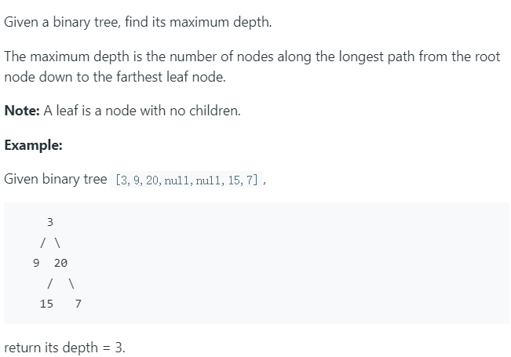

# 104. Maximum Depth of Binary Tree




二叉树最大深度

这里采用深度优先搜索，遍历二叉树，最简单的思路是使用递归。


python代码如下：

```python
# Definition for a binary tree node.
# class TreeNode(object):
#     def __init__(self, x):
#         self.val = x
#         self.left = None
#         self.right = None

class Solution(object):
    def maxDepth(self, root):
        """
        :type root: TreeNode
        :rtype: int
        """
        
        """
        if not root:
            return 0
        stack = []
        stack.append((1, root))
        depth = 0
        while stack:
            cur_depth, node = stack.pop(0)
            if node:
                depth = max(depth, cur_depth)
                stack.append((cur_depth + 1, node.left))
                stack.append((cur_depth + 1, node.right))
            
        return depth
        """      
        
        if not root:
            return 0
        else:
            return max(self.maxDepth(root.left),self.maxDepth(root.right)) + 1
```

