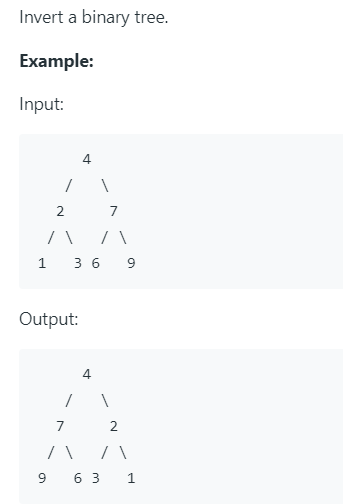

# 226. Invert Binary Tree



翻转二叉树，思路是遍历树，然后将左右子树交换。

递归代码简洁，但是如果树很高，最好使用栈来代替。


python代码如下：

```python
# Definition for a binary tree node.
# class TreeNode(object):
#     def __init__(self, x):
#         self.val = x
#         self.left = None
#         self.right = None

class Solution(object):
    def invertTree(self, root):
        """
        :type root: TreeNode
        :rtype: TreeNode
        """
        """
        if not root:
            return None
        stack = [root]
        
        while stack:
            node = stack.pop(0) # 将树的第一个节点拿出
            node.left, node.right = node.right, node.left
            # 如果左右节点不为空，加入栈中，此时栈中只存有左右节点。所以最后遍历完，栈一定为空
            if node.left:
                stack.append(node.left)
            if node.right:
                stack.append(node.right)
        """
        if root:
            invert = self.invertTree
            root.left, root.right = invert(root.right), invert(root.left)
        
        return root
        
```

