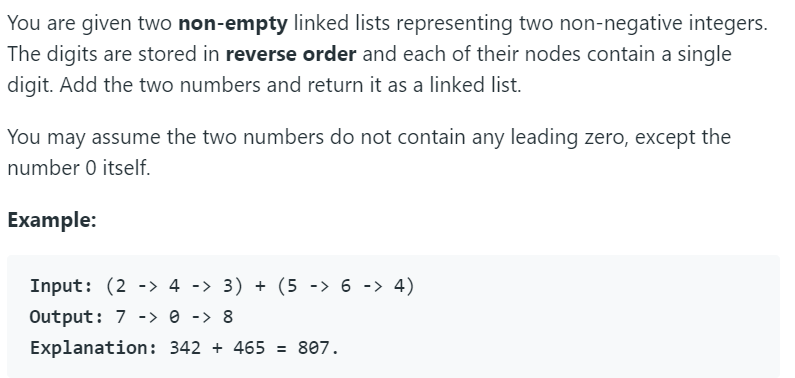

# 2. Add Two Numbers



单链表解法。

单链表是由多个node组成，每个node中含有一个value和一个指向下一个node的指针next。

```python
class ListNode(object):
     def __init__(self, x):
         self.val = x
         self.next = None
```

`result = ListNode(0) `创建一个头结点为0的单链表。

`result_tail = result` 将result_tail指向result，此时对result_tail操作会影响result。链表结构为

`0 -> None`

`result_tail.next = ListNode(1)` 将result_tail与值为1的单链表连接。此时result_tail结构为

`0 -> 1 -> None`

`result_tail = result_tail.next` 将值为1的单链表作为新的result_tail。

此时result的链表结构为`0 -> 1 -> None`，result_tail为`1 -> None`


回头来看这道题，很简单的一道初等数学题，按位相加，满10进1。

python代码如下：

```python
# Definition for singly-linked list.
# class ListNode(object):
#     def __init__(self, x):
#         self.val = x
#         self.next = None

class Solution(object):
    def addTwoNumbers(self, l1, l2):
        """
        :type l1: ListNode
        :type l2: ListNode
        :rtype: ListNode
        """
        result = ListNode(0)
        carry = 0
        result_tail = result
        
        while(l1 or l2 or carry):
            val1 = (l1.val if l1 else 0)
            val2 = (l2.val if l2 else 0)
            carry, out = divmod(val1 + val2 + carry, 10)
            # output = a // b, a % b
            
            result_tail.next = ListNode(out)
            result_tail = result_tail.next
            
            l1 = (l1.next if l1 else None)
            l2 = (l2.next if l2 else None)
        
        return result.next
```

