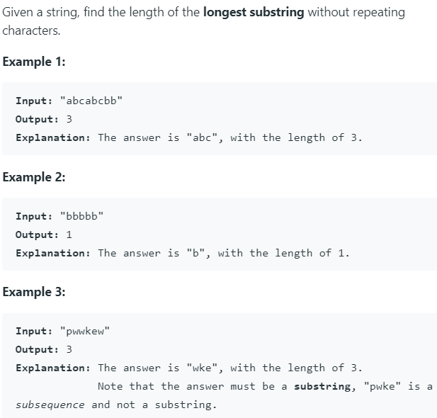

# 3. Longest Substring Without Repeating Characters



此题使用滑动窗口为最优。

如果采用暴力解法，复杂度会达到O(n^3)。

滑动窗口的思路为，定义一个map来存储访问过的字符，key为字符，value为字符索引位置 + 1。加1表示从字符位置后一个才开始不重复。

不重复字符开始位置为start。然后遍历字符串，此时会遇到字符重复的情况，获取重复字符的value值，这个值应为重复字符第一次出现的位置+1，然后将这个值与start比较，取较大的那个，这是为了保证start不会向前回移。（比如abcabc字符串，假如start此时在第二个a位置，如果直接将start赋值为value+1，start会回跳到第一个b的位置）

最后无论是否更新start，都要更新结果（与当前最大比较）和map。


python代码如下：

```python
class Solution:
    def lengthOfLongestSubstring(self, s: str) -> int:
        if not s:
            return 0
        
        start = result = 0
        used = {}
        for i in range(len(s)):
            if s[i] in used:
                start = max(used[s[i]], start)
            result = max(result, i - start + 1)
            used[s[i]] = i + 1
        return result
```

