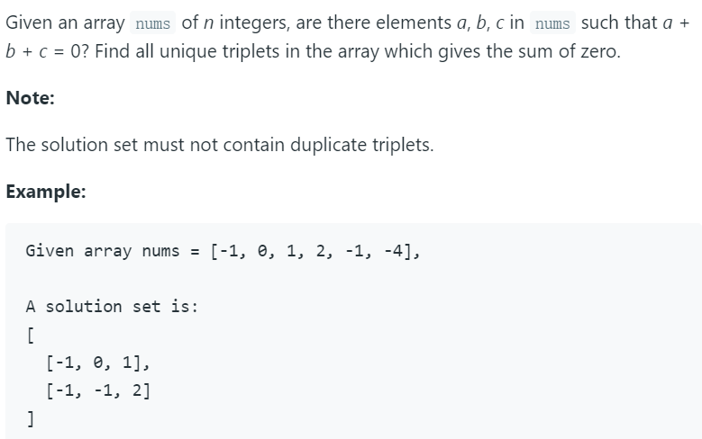

# 15. 3Sum



---

本题思路为双指针。

首先将数组排序，然后从头开始用`i`遍历数组，然后采用左指针`l`和右指针`r`，左指针从`i+1`开始，右指针从数组末尾开始。

将三个位置的数字相加，得到一个sum，考虑以下几种情况：

- 第一种情况，`sum > 0`，说明sum太大，所以要将右指针向左移动（因为数组已经排好序）。

- 第二种情况，`sum < 0`，说明sum太小，所以要将左指针向右移动。

- 第三种情况，`sum = 0`，找到和为0的三个数，将其存起来。

我们只遍历到倒数第三个元素，最后两个元素跳出循环，因为最后两个元素不能组成三个数的和。

如果在遍历的过程中，当前元素与上一个元素一样，则跳过当前元素。因为上一个元素已经与之后的所有元素组合过，所以如果再使用一次相同的元素，会得到一次相同的结果，这样会导致最终的数组中有重复的组合。

最后我们需要将左右指针移向下一个不同的元素，如果不移向不同的元素的话，例如`[-2,0,0,2,2]`会得到两个相同的组合`[-2,0,2]`。

时间复杂度为O(n^2), 排序算法复杂度为O(nlogn)，两次循环为O(n^2)，所以最终为O(nlogn + n^2) = O(n^2)。空间复杂度为O(n)，只使用了一个result来存储。n为nums的长度。

python代码如下：

```python
class Solution:
    def threeSum(self, nums: List[int]) -> List[List[int]]:
        if not nums:
            return []
        result = []
        nums.sort()
        
        for i in range(len(nums)-2):
            if nums[i] > 0:
                break
            
            if i > 0 and nums[i] == nums[i-1]:
                continue
                
            l = i + 1
            r = len(nums) - 1
            
            while(l < r):
                temp_sum = nums[i] + nums[l] + nums[r]
                if temp_sum < 0:
                    l += 1
                elif temp_sum > 0:
                    r -= 1
                else:
                    result.append([nums[i], nums[l], nums[r]])
                    while l < r and nums[l] == nums[l+1]:
                        l += 1 # 移到下一个相同元素的位置
                    while l < r and nums[r] == nums[r-1]:
                        r -= 1
                            
                    l += 1 # 移到下一个不同元素的位置
                    r -= 1                      
        return result
```

